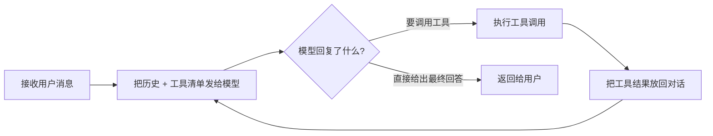

# 前言

## 从一次"帮我改个 Bug"说起

想象一个普通的下午。你在终端里敲下这样一句话：

```
帮我看看这个项目为什么构建失败，并修复它。
```

几秒钟后，一个"AI 程序员"开始行动：它先读取项目文件，然后运行构建命令，
看到报错后修改源码，再重新构建确认修复，最后给你一段总结。

这个"AI 程序员"就是一个 **Agent（智能体）**。但请你停下来想一想：
**它到底是怎么"自动完成"这一系列动作的？** 是谁在指挥它先读文件、再跑命令、
再改代码？它为什么不会"卡死"在第一步？它又是怎么知道"构建失败"这个信息，
然后决定去改哪一行代码的？

如果你能回答这些问题，你对 Agent 的理解就已经超过了绝大多数只会"调 API"的开发者。
这本书的目标，就是带你把这些问题一个个拆开、读懂、吃透。

## 为什么用"读代码"的方式来学 Agent

学习 Agent 有两条路：

- **使用派**：熟练使用各种 Agent 产品（Copilot、Cursor、Codex……）和框架（LangChain、AutoGPT……），
  会写 prompt、会配工具。这条路上手快，但遇到"为什么这个 Agent 卡住了？""为什么它反复
  犯同一个错误？""为什么它有时会乱改文件？"这类问题，就无从下手。
- **原理派**：直接读一个真实 Agent 的实现代码，理解它的推理循环、工具调度、上下文管理、
  安全边界。这条路入门慢，但一旦读懂，任何 Agent 框架在你眼里都不再是黑盒，你甚至能
  自己动手写一个。

这本书坚定地走**原理派**，但用**使用派**的方式降低门槛：
我们不讲复杂的数学，不假设你懂深度学习，我们只做一件事——**把三个真实的 Agent 代码库
里最核心的几百行代码，掰开揉碎，逐行讲给你听**。

## 为什么是这三个代码库

市面上 Agent 代码库很多，为什么偏偏选 pi、dsh、codex 这三个？

因为**它们恰好覆盖了 Agent 实现的三个典型维度**，而且都是开源的、可以本地运行、
代码质量高：

| 维度 | 代表 | 我们学什么 |
|------|------|-----------|
| **最小可读性** | pi | 用尽量少的代码讲清"推理循环"长什么样，它是最佳的第一课 |
| **工程化/插件化** | dsh（DeepSeek Harness） | Agent 如何被拆成模块、如何用插件扩展、如何用会话日志保证可复现 |
| **生产级严谨** | codex（OpenAI Codex） | 一个每天被上万人使用的 Agent 是如何处理重试、压缩、沙箱、并发的 |

三个代码库也代表三种语言和三种工程哲学：

- pi 用 **TypeScript**，风格克制、注释到位，适合作为"教科书"；
- dsh 用 **TypeScript**，但强调"一切皆插件"，适合学架构；
- codex 用 **Rust**，把类型安全、错误处理做到极致，适合学工程严谨性。

同一个概念，你在三个库里看到的会是"简单版 → 工程版 → 生产版"的递进。
读完这本书，你会获得一种**贯通三种实现**的视角——这在只读一个框架的教程里是得不到的。

## 三个代码库，一个共同的心跳

先剧透一下全书的"主角"——**推理循环（Agent Loop）**。无论哪个代码库，
Agent 的核心都是一个不断重复的循环，你可以把它想象成一个"思考 → 行动 → 观察"的
工作循环：



你会惊讶地发现：pi、dsh、codex 里那个"最核心"的函数，长得都和这个图一模一样。
只是有的用了 20 行实现，有的用了 2000 行。**差别不在"是什么"，而在"每一步加了什么保险"。**
这，就是全书想传递的最重要的洞察。

## 本书的约定与致谢

- 全书使用简体中文；术语首次出现时加粗并给出通俗解释，统一收录在附录 A。
- 代码片段均标注来源文件路径；阅读时请以你本地代码库的实际版本为准。
- 每章末尾的"动手练习"建议都做一遍，尤其是第 6 章之后的练习——**动手改代码，
  是检验你是否真的读懂的试金石**。
- 感谢三个开源项目及其维护者：pi、DeepSeek Harness（dsh）、OpenAI Codex。
  正是他们把生产级别的 Agent 代码开源，才有了这本书。

现在，我们正式开始。从最基础的问题开始：**Agent 到底长什么样？**
