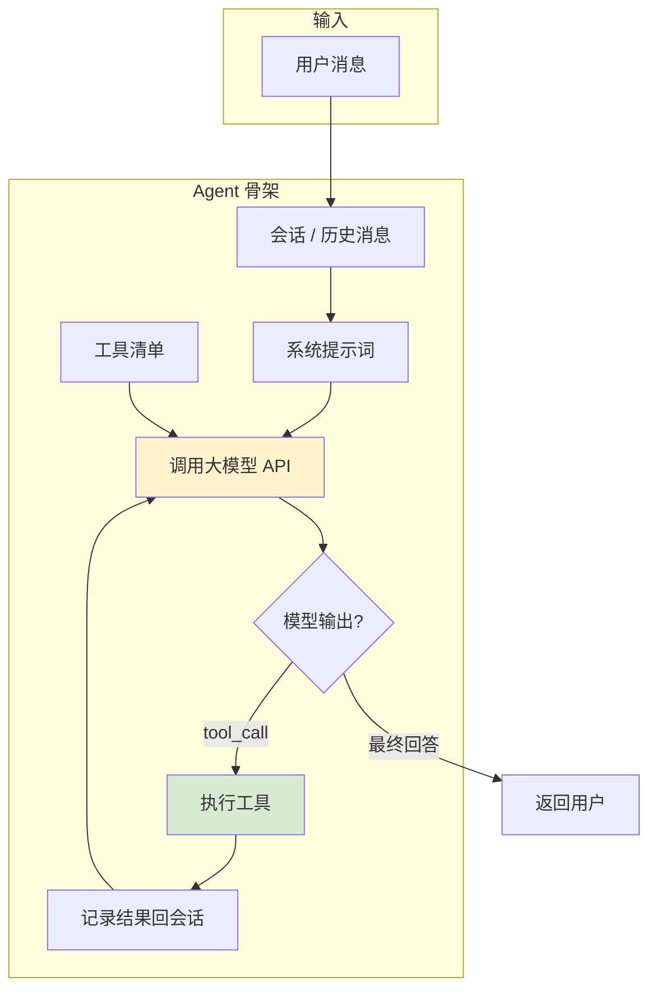
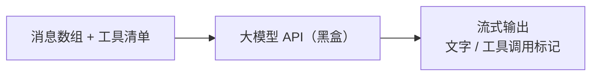

# 第 1 章 你好，Agent：从一次提问说起

> **本章目标**
> 1. 理解 Agent（智能体）是什么、和普通聊天机器人有什么区别；
> 2. 建立"模型 + 循环 + 工具"的心智模型；
> 3. 从整体上认识 pi、dsh、codex 三个代码库的定位；
> 4. 第一次看到"推理循环"的样子，为后面精读代码打底。

## 1.1 一个生活化的开场：请个"新同事"帮你干活

假设你的团队来了一个新同事，能力很强，但**对公司一无所知**。
你要给他安排一件复杂的活儿："把那个老项目的构建问题解决掉，顺便把文档更新了。"

你不可能只喊一句"去干活"就撒手不管，你会：

1. 给他一份"工作手册"——告诉他项目的背景、代码在哪里、构建命令是什么、要注意什么规范；
2. 给他一些"工具"——让他能看代码（编辑器）、能跑命令（终端）、能查资料（浏览器）；
3. **盯住他干活**——他每做一步，你检查一步：他看懂了没有？他跑了什么命令？
   结果对不对？如果方向偏了，你立刻纠正；
4. 他干完活了，向你汇报。

Agent 的工作方式，和这位"新同事"一模一样。我们把上面的流程翻译成技术名词：

| 生活场景 | 技术名词 |
|---------|---------|
| 工作手册 | **系统提示词（System Prompt）** |
| 看代码、跑命令的工具 | **工具（Tool / Function Calling）** |
| 盯住他干活、一步步纠正 | **推理循环（Agent Loop）** |
| 干活过程中记下来的上下文 | **会话（Session）/ 上下文（Context）** |

**Agent = 大模型 + 推理循环 + 工具**。这三样缺一不可。

## 1.2 Agent 和"聊天机器人"到底差在哪

你用过 ChatGPT 聊天，也见过"AI 自动改代码"，两者的底层模型可能是一样的，
但体验天差地别。差别就在三个地方：

1. **聊天机器人是"一次性问答"**：你问一句，它答一句，答完就结束了。
   Agent 是"多轮自主行动"：它可以持续调用工具、观察结果、调整策略，直到任务完成。

2. **聊天机器人"没有手"**：它只能输出文字。Agent **能调用工具**——读文件、写文件、
   跑命令、发请求，然后把结果拿回来继续思考。

3. **聊天机器人"不记得过程"**：每次回答只看你当前的输入。Agent **管理整个会话**——
   它会记住自己调过哪些工具、结果是什么，并基于这些继续推进。

一句话概括：**聊天机器人是"问答"，Agent 是"执行任务"。** 而"执行任务"的能力，
来自一个看似简单、实则玄机无穷的循环——这就是全书的核心。

## 1.3 先看结果：一次完整的 Agent 对话

假设你运行 pi（一个命令行 Agent），输入：

```
帮我统计这个目录下所有 .ts 文件的行数总和。
```

背后会发生什么？我们先从"用户视角"看它打印出来的过程（伪代码示意）：

```text
> 用户：帮我统计这个目录下所有 .ts 文件的行数总和。

● Agent 思考……（先规划：用 bash 工具，find + wc）
● 调用工具 bash（参数：find . -name "*.ts" | xargs wc -l）
  ✓ 工具返回：总计 12345 行
● Agent 思考……（拿到结果，组织回答）
✓ Agent 回答：这个目录下共有 42 个 .ts 文件，合计 12345 行。
```

请注意中间那个 **"调用工具 → 拿到结果 → 再思考"** 的过程。
这个过程在技术上叫 **推理循环中的一个"步骤（step）"**。一次任务可能包含很多步骤：
读文件 → 跑命令 → 看结果 → 改代码 → 再跑命令……每循环一次，Agent 就离目标近一步。

## 1.4 走进三个代码库的大门

现在我们把目光投向本书的三个主角。先花 5 分钟认识它们的"门面"，
后面每一章都会深入它们内部。

### pi：一个"教科书式"的 Agent 运行时

pi（<https://github.com/earendil-works/pi>）是一个用 TypeScript + Bun 编写的 Agent。
它最大的特点是**结构干净、代码可读**。它由几个包组成，对本书最重要的是：

| 包 | 作用 |
|----|------|
| `@earendil-works/pi-agent` | Agent 运行时：推理循环、工具调用、状态管理 |
| `@earendil-works/pi-ai` | 统一的 LLM 接入层：支持 OpenAI、Anthropic、Google 等多家模型 |
| `@earendil-works/pi-coding-agent` | 交互式命令行 Agent 的完整实现（CLI） |

我们的第一个代码精读（第 6 章），会读 `packages/agent/src/agent-loop.ts` 里的
推理循环——**那是全书写得最清楚的一个循环**。

### dsh：一个"一切皆插件"的企业级框架

dsh（DeepSeek Harness）是本书所在仓库，是一个基于 Cordis 的插件化 Agent 框架。
它的核心理念在 AGENTS.md 里写着：**"everything is a plugin（一切皆插件）"**。
它把 Agent 拆成几十个小包：

- `packages/core/agent-loop`：推理循环（回合/步骤驱动）；
- `packages/core/agent`：Agent 的抽象、事件分发、收件箱；
- `packages/core/session`：会话与日志（保证"模型看到的都能重建"）；
- `packages/core/system-prompt`：系统提示词组装；
- `packages/llm`：LLM 能力层（统一模型抽象 + 各家适配器）。

我们会在第 7 章精读它的 `agent-loop`，看"回合（turn）与步骤（step）"这套
成熟的设计；第 11、12 章再看它的会话日志和插件机制。

### codex：一个"生产级"的 Rust Agent

codex（OpenAI Codex CLI）是 OpenAI 官方开源的命令行编程 Agent，用 Rust 编写。
它每天被大量开发者使用，所以它的代码里充满了对**稳定性、安全、性能**的极致追求。
核心代码在 `codex-rs/core/src/`：

- `session/turn.rs`：一次"回合（turn）"的完整处理——这是全书第 8 章的主角；
- `tasks/regular.rs`：回合的外层任务驱动；
- `tools/`：工具调度、沙箱、审批；
- `context_manager/`：上下文压缩（compaction）。

## 1.5 三库对照：先看它们共同的"骨架"

三个代码库虽然实现风格迥异，但作为 Agent，它们共享同一套"骨架"。
我们用一张图画出这个共同骨架（这就是本书反复出现的那张图）：



对照一下三个库，你会发现它们各自给这个骨架起了不同的名字：

| 概念 | pi | dsh | codex |
|------|-----|-----|-------|
| 骨架里的"循环" | `runLoop`（双层循环） | `ReactLoopAgent`（turn/step） | `run_turn`（回合循环） |
| "历史消息" | `AgentContext.messages` | `Session` + `deriveMessages()` | `Session` + `clone_history()` |
| "模型输出" | `AssistantMessage` | `assistant/message`（含 tool-call 块） | `ResponseItem` |
| "执行工具" | `executeToolCalls` | `executeToolCalls`（scheduler） | `ToolCallRuntime` |
| "工具清单" | `context.tools` | `assembleContextFor` 组装 | `build_prompt` 组装 |

**这一页是全书的总纲。** 后面的每一章，都是围绕这张图里的某一个部分深入。
如果你现在能看懂这张图，就已经比 80% 的"Agent 使用者"更懂 Agent 了。

## 1.6 一个重要的心理建设：模型是"黑盒"，我们只关心"循环"

读这本书时，请你记住一个约定：**我们永远不深入大模型内部**（什么注意力机制、
Transformer、tokenizer），我们把模型当作一个**黑盒 API**。

在代码层面，模型对我们只暴露两个东西：

1. **输入**：一个"消息数组"（对话历史）+ 一个"工具清单" + 系统提示词；
2. **输出**：一段流式文本，文本里可能夹杂着"我要调用某个工具、参数是这些"的特殊片段。



Agent 工程的核心难点，从来不在模型内部，而在**围绕这个黑盒怎么组织循环、管理上下文、
执行工具、保证安全**。这正是这本书要教你写的那部分代码。

## 1.7 本章小结

- **Agent = 大模型 + 推理循环 + 工具**；
- Agent 与聊天机器人的区别：多轮自主、能调工具、有会话记忆；
- 本书用三个代码库对照学习：pi（可读）、dsh（插件化）、codex（生产级）；
- 三库共享同一个骨架：会话 → 组装提示 → 调模型 → 判断输出 → 执行工具 → 循环；
- 我们把模型当黑盒，聚焦于环绕它的工程代码。

## 动手练习

1. **画一遍骨架图**：合上书，凭记忆画出"Agent 骨架"那张图，标出每个环节在你心里的
   一句话解释。
2. **预览三个库**：分别在三个代码库里找到本章 1.4 节列出的那些核心目录/文件，
   感受一下每个库的组织风格（文件多不多、注释多不多）。
3. **试运行**：如果你本地配置了 `DEEPSEEK_API_KEY`，在 dsh 仓库运行
   `pnpm dsh --profile headless "你好，介绍一下你自己"`，观察一次最简单的 Agent 对话；
   没有 key 也没关系，先看代码即可。

---

**下一章**：[第 2 章 Agent 的骨架：会话、上下文与消息](02-会话与消息.md)
我们深入"骨架"的底层——看看 Agent 赖以工作的"记忆"（消息与会话）到底怎么组织。
