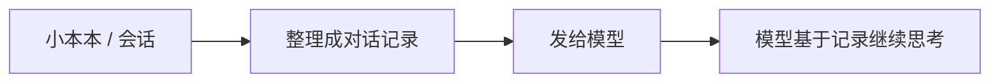
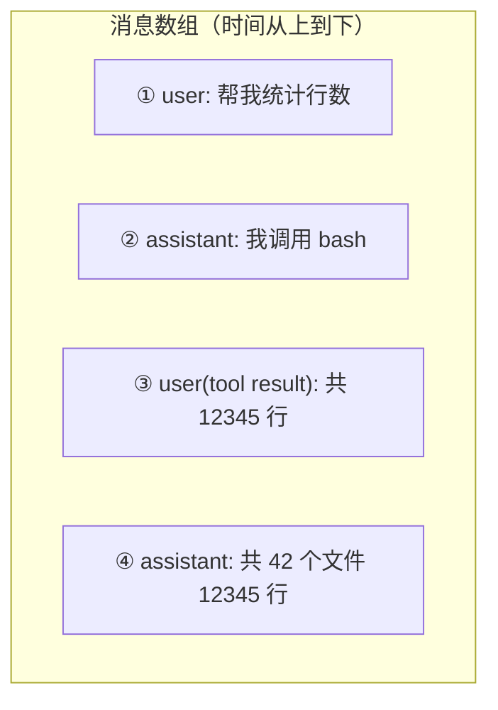

# 第 2 章 Agent 的骨架：会话、上下文与消息

> **本章目标**
> 1. 理解 Agent 的"记忆"由什么构成：消息（Message）、会话（Session）、上下文（Context）；
> 2. 掌握三种核心消息角色：user / assistant / tool result；
> 3. 看懂消息内部的结构：内容块（content block）与工具调用块；
> 4. 对照三个代码库，看它们如何定义和组织消息。

## 2.1 生活化开场：Agent 的"小本本"

上一章我们认识了 Agent 这位"新同事"。他干活时手里会一直拿着一个**小本本**。
这个本子记录着：

- 你（老板）说过的话；
- 他（自己）说过的话；
- 他干过哪些活、结果如何（工具调用与结果）；
- 他的"工作手册"（系统提示词）。

这个"小本本"在技术上就是 Agent 的**会话（Session）与上下文（Context）**。
**Agent 每次思考前，都会把小本本的内容整理成一份"对话记录"发给模型。**
模型没有记忆，它的全部"记忆"都来自你发给它的这份记录。这句话请务必记住，
它是理解 Agent 一切设计的钥匙。



因为模型"看得到的就是全部"，所以工程上有一条铁律（dsh 的 AGENTS.md 里原话是）：
> **Model-visible ⟺ logged**：任何模型能看到的信息，都必须能从会话日志中重建。

我们第 11 章会深入这条铁律，现在先建立直觉。

## 2.2 三种消息角色：谁在说话

模型收到的"对话记录"是一串**消息（Message）**。绝大多数模型 API 里，
每条消息都有一个 **role（角色）**，告诉模型"这句话是谁说的"。最基本的角色：

| 角色 | 是谁 | 在代码库里的名字 |
|------|------|------------------|
| `system` | 系统/工作手册 | system prompt |
| `user` | 用户/工具结果 | user message |
| `assistant` | Agent 自己 | assistant message |

其中有个容易混淆的点：**工具结果在 API 层面通常也归为 `user` 角色**。
因为从模型的角度看，"工具返回的结果"是外部世界给它的"输入"，和用户说话是同一类来源。
我们用三个代码库的真实定义来验证这一点。

### pi 的消息模型

pi 里消息类型定义在 `packages/ai/src/types.ts`，Agent 层在
`packages/agent/src/types.ts` 复用了它。它的核心类型 `Message` 有一个 `role` 字段，
而 `AssistantMessage` 的内容是一个**内容块数组**，每个块有独立的 `type`：

```ts
// pi packages/ai/src/types.ts（节选）
export interface AssistantMessage {
  role: "assistant";
  content: AssistantContentPart[]; // 可能是 text / thinking / toolCall
  stopReason?: string;
  usage?: Usage;
}
```

一个"要调用工具"的 assistant 消息，内容里就会有一个 `type: "toolCall"` 的块：

```json
{
  "role": "assistant",
  "content": [
    { "type": "text", "text": "我先用 bash 统计一下行数。" },
    { "type": "toolCall", "id": "call_1", "name": "bash", "arguments": "find . -name '*.ts' | xargs wc -l" }
  ]
}
```

### dsh 的消息模型

dsh 的消息定义在 `packages/llm/llm/src/message.ts` 和 `types.ts`。
它把消息收敛为**同一种表示**（`Message`），再派生三个子类型，角色只有三种：

```ts
// dsh packages/llm/llm/src/message.ts（节选）
export interface Message {
  readonly role: 'system' | 'user' | 'assistant'  // 只有三种角色
  readonly content: ContentBlock[]                 // 内容块数组
}

export interface UserMessage extends Message { readonly role: 'user' }
export interface AssistantMessage extends Message { readonly role: 'assistant' }

/** 工具结果的特殊化：user 角色 + 保留调用关联 */
export interface ToolResultMessage extends Message { readonly role: 'user' }
```

注意 dsh 那句注释：**工具结果（ToolResultMessage）也是 `user` 角色**，
只是保留了一个"调用关联"（call correlation），让模型知道这个结果对应哪次工具调用。

dsh 的内容块类型（`packages/llm/llm/src/types.ts`）用 `ContentBlockMap` 合并扩展：

```ts
// dsh packages/llm/llm/src/types.ts（节选）
export interface TextBlock      { type: 'text';      text: string }
export interface ReasoningBlock { type: 'reasoning'; text: string }   // 思考过程
export interface ImageBlock     { type: 'image';     ... }
export interface ToolCallBlock  { type: 'tool-call'; id: CallId; name: string; arguments: string }
export interface ToolResultBlock{ type: 'tool-result'; callId: CallId; ... }
```

一个"模型说要调 bash 工具"的 assistant 消息，在 dsh 里长这样：

```json
{
  "role": "assistant",
  "content": [
    { "type": "text", "text": "我先统计行数。" },
    { "type": "tool-call", "id": "call_1", "name": "bash", "arguments": "find . -name '*.ts' | xargs wc -l" }
  ]
}
```

有没有发现——**pi 和 dsh 的消息模型几乎一模一样**？这不是巧合：
它们都遵循了主流模型 API（OpenAI / Anthropic / DeepSeek）的事实标准。

### codex 的"消息"：ResponseItem

codex 用 Rust 实现，它的"消息"叫 **ResponseItem（响应条目）**，更贴近 OpenAI
Responses API 的术语。它也是一个带 `type` 的枚举，常见的有：

| ResponseItem 类型 | 含义 |
|------------------|------|
| `message` | 一条消息（里面再分 role） |
| `function_call` | 一次函数（工具）调用 |
| `function_call_output` | 函数调用的输出（结果） |
| `computer_call` | 调起沙箱/终端 |
| `local_shell_call` | 本地 shell 调用 |

在后面第 8 章精读 codex 时，你会看到它循环里反复出现"这个回合返回了什么类型的
ResponseItem"，再根据类型决定是执行工具还是结束回合。

## 2.3 消息是"数组"，顺序就是记忆

现在做个简单的总结：**Agent 的"记忆"本质上是一个有序的消息数组。** 顺序极其重要——
模型按顺序阅读，后面的内容基于前面的内容理解。



一次完整的"思考—行动—观察"会往数组里追加 **至少两条** 消息：
- 第 ② 条：assistant 说要调用工具；
- 第 ③ 条：工具结果（role 为 user）。

然后下一轮，模型会看到 ①②③ 全部历史，继续输出第 ④ 条。这个"追加历史 → 再请求"的
模式，正是下一章"工具"和第五章"推理循环"的基础。

## 2.4 三库对照：消息的"家"在哪

三个代码库各自管理消息数组的入口：

| 职责 | pi | dsh | codex |
|------|-----|-----|-------|
| 消息类型定义 | `packages/ai/src/types.ts` | `packages/llm/llm/src/message.ts` | `codex-rs/core/src/...`（ResponseItem 由 protocol 定义） |
| 会话状态容器 | `AgentContext.messages` | `Session`（持久化日志） | `Session`（`clone_history()`） |
| 消息追加点 | `context.messages.push(...)` | `session.append('user/message' \| 'assistant/message', ...)` | `sess.record_conversation_items(...)` |
| 工具结果角色 | `role: "user"`（ToolResultMessage） | `role: "user"`（ToolResultMessage） | `function_call_output`（独立条目） |

这里藏着一个重要的架构分叉，提前剧透：

- **pi 的 `context.messages` 是"纯内存"的**：跑完就没了，不落盘。
- **dsh 的 `Session` 是"持久化日志"**：每一条消息都是一个**事件**，被追加进会话日志，
  可以随时从日志重建出完整的消息历史（第 11 章详述）。
- **codex 的 `Session` 也是持久化的**，并且存了"世界状态"（world state），
  用于上下文压缩时重建环境快照。

一句话：**消息是 Agent 的记忆，会话是记忆的家。** 有的家是"一次性的纸片"（pi），
有的家是"永久档案柜"（dsh / codex）。

## 2.5 动手：亲手看一条消息长什么样

在 pi 仓库里，找到 `packages/ai/src/types.ts` 中 `AssistantMessage` 的定义，
然后回答：

1. `content` 数组里可能有哪些 `type`？找全它们（text / thinking / toolCall / image 等）。
2. 一个 `toolCall` 块有哪些字段？`arguments` 是字符串还是对象？为什么是字符串？
   （提示：模型输出的参数是一段 JSON 文本，需要解析，见第 7 章 `parseArguments`。）

在 dsh 仓库里，找到 `packages/llm/llm/src/types.ts` 的 `ContentBlockMap`，
对比它和 pi 的 `AssistantContentPart`，数一数两边各自支持多少种内容块。

## 2.6 本章小结

- 模型没有记忆，它的"记忆"就是每次发给它的消息数组；
- 消息有三种核心角色：system / user / assistant；工具结果归为 user 角色；
- 消息内部是"内容块"数组，其中 `tool-call` 块是 Agent 能力的钥匙；
- pi 的消息在内存里，dsh / codex 的消息在持久化会话里；
- 三个代码库的消息模型高度一致，因为它们都遵循主流模型 API 的约定。

## 动手练习（汇总）

1. 打开三个代码库，分别找到"assistant 消息"的类型定义，写出每个库里
   "模型要调用工具"的消息长什么样（JSON 形式）。
2. 思考题：为什么工具结果要用 `user` 角色而不是单独的 `tool` 角色？
   提示：想一想老模型 API 不认识 `tool` 角色时会怎样。

---

**下一章**：[第 3 章 工具：Agent 的双手](03-工具.md)
消息里那个神秘的 `tool-call` 块，即将揭开面纱——看 Agent 如何真的"动手"。
