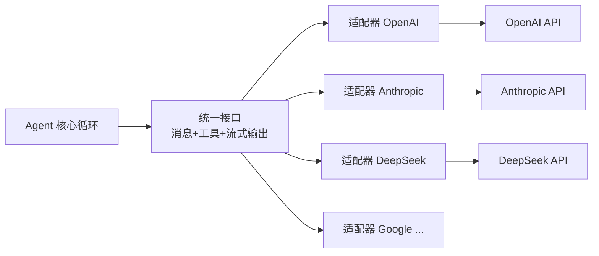

# 第 4 章 模型接入：从 API 到统一抽象

> **本章目标**
> 1. 理解"模型是黑盒 API"如何被框架封装成一个统一抽象；
> 2. 看懂三种接入策略：直接封装（pi）、服务定义/适配器（dsh）、生产级客户端（codex）；
> 3. 理解流式输出（streaming）为什么对 Agent 至关重要；
> 4. 建立"能力接缝（capability seam）"的直觉，为第 12 章扩展打基础。

## 4.1 生活化开场：翻译官与统一接口

你的 Agent 要跟很多家公司的大模型"说话"——OpenAI、Anthropic、DeepSeek、Google……
这些公司都提供了 HTTP API，但**各家 API 的格式千差万别**：

- OpenAI 用 `/v1/chat/completions` 或 Responses API；
- Anthropic 用 `/v1/messages`，消息结构略有不同；
- DeepSeek 兼容 OpenAI 格式但有自己的字段；
- Google 的 Gemini 又是另一套。

如果你的 Agent 代码里到处写着 `fetch("https://api.openai.com/...")`，
那么每接一家新模型，你就要改一大片代码。怎么办？

答案是**加一层"翻译官"**：定义一个**统一的内部接口**，让 Agent 核心只跟这个接口打交道；
再为每家公司写一个"适配器（adapter）"，负责把统一接口翻译成各家 API 的格式。



Agent 核心**永远不直接碰任何一家 API**，只依赖统一接口。
这就是本章要讲的"模型接入"。

## 4.2 统一接口长什么样

回忆第 2、3 章：模型在代码层面只暴露两件事——**输入**（消息数组 + 工具清单 + 系统提示词）
和**输出**（流式文本 + 工具调用块）。所以统一的"翻译官"接口，本质上只有两个方向：

- **向外请求（input）**：把统一的消息/工具结构翻译成某家 API 的请求体；
- **向内解析（output）**：把某家 API 返回的流式数据，翻译回统一的内容块。

dsh 把这两件事打包成一个 `GenerateOptions` 请求结构（第 3 章见过）和一个
**流式响应**。响应是一个个 `StreamChunk`（流式块），Agent 循环逐块消费：

```ts
// dsh packages/llm/llm/src/types.ts（StreamChunk 类型，节选）
| { type: 'block-start'; index: number; blockType: ContentBlockType }  // 某个内容块开始
| { type: 'text-delta'; index: number; text: string }                 // 一段文本增量
| { type: 'reasoning-delta'; index: number; text: string }            // 思考过程增量
| { type: 'tool-call-delta'; index: number; id: CallId; name?: string; argumentsDelta: string }
| { type: 'block-end'; index: number; block: ContentBlock }           // 某个内容块结束
| { type: 'usage'; usage: TokenUsage }
| { type: 'finish'; reason: ... }                                     // 生成结束
```

**为什么必须用流式？** 因为模型生成一段很长的回答可能要几十秒。
如果等它全部生成完再返回，Agent 会"呆住"很久；而流式让 Agent **边生成边消费**，
立刻就能看到"模型开始说/开始声明要调用工具了"。对工具调用尤其重要——
模型一旦输出 `tool-call-delta`，Agent 就能尽早知道"它要调工具了"。

pi 的流式接口是 `Models.streamSimple(model, context, options)`，返回一个
`AssistantMessageEventStream`，同样是一连串事件（`text_delta`、`toolcall_delta`……）。
pi 的 `packages/ai/src/models.ts` 里，`streamSimple` 会把请求分发给
**当前模型所属的 provider**：

```ts
// pi packages/ai/src/models.ts（节选，思路）
streamSimple(model, context, options) {
  const provider = this.providers.get(model.provider);   // 找到适配器
  return provider.streamSimple(model, context, options); // 交给适配器
}
```

## 4.3 三种接入策略对照

三个代码库对"模型接入"的处理方式，恰好代表三种工程层次：

### pi：统一对象模型 + 一大批适配器

pi 的 `packages/ai/` 是它的"统一 LLM API"。它定义了一套**统一对象模型**
（`Model`、`Message`、`Tool`、`Usage`……），然后为**几十家** provider 各写一个适配器
（`providers/` 目录下：openai.ts、anthropic.ts、deepseek.ts、google.ts……）。

每家适配器负责两件事：
1. 把统一的 `Context`（系统提示 + 消息 + 工具）序列化成该家的请求；
2. 把该家的流式响应反序列化成统一的 `AssistantMessageEventStream`。

pi 甚至为每家维护了一份**模型目录**（`*.models.ts`），列出该家所有模型及其能力
（上下文窗口、是否支持图片、是否支持 reasoning 等），实现"模型发现与选择"。

### dsh：服务定义 + 适配器注册表（能力接缝）

dsh 的做法更"工程化"。它遵循仓库里反复强调的一个原则——
**能力接缝（capability seam）**：由 **Service Definition（服务定义）/ Service Provider
（服务提供者）/ Consumer（消费者）** 三种角色组成，缺一不可。

在 `packages/llm/` 里：

- **Service Definition**：`LlmRuntime`（`packages/llm/llm/src/index.ts`），
  定义了统一的流式调用 API（`stream()`、`prepareCall()`）；
- **Service Provider（适配器）**：`packages/llm/llm-deepseek/`（DeepSeek 适配器）、
  `packages/llm/llm-pi-ai/`（复用 pi 的 provider 生态）；
- **Consumer**：Agent 循环（`agent-loop`），只调用 `ctx.llm.stream(request)`，
  从不关心背后是哪家模型。

关键差异：dsh 的接入层是**插件式注册**的。哪个适配器被启用，由 cordis.yml
配置决定。而且 `LlmRuntime` 还支持**瀑布拦截（waterfall）**——任何插件都可以在
"真正调用模型之前"插入逻辑（重试、路由、缓存、重放）。这让"换模型"、
"加中间件"变成了配置/插件的活，而不是改核心代码的活。

> **dsh 的一个经典设计**：请求是"深冻结"的（deep-freeze），并且**纯由会话日志派生**
> （标记为 `markAgentLoopRequest`）。这意味着任何人都可以在不修改核心循环的前提下，
> 拦下请求、读它、甚至替换它——因为请求内容可重建、可验证。

### codex：生产级客户端 + 协议层

codex 用 Rust 实现了自己的模型客户端（`model-provider/`、`responses-api-proxy/`、
`codex-client/` 等）。它对接的是 OpenAI 的 Responses API，但同样抽象出了
"Provider 信息（model_info、上下文窗口、流式重试次数）"和"ModelClientSession"。

codex 甚至支持把请求**代理转发**到本地模型服务（`ollama/`、`lmstudio/`、
`responses-api-proxy/`），这就是它在 `ollama`、`lmstudio` 目录里做的事——
一套"模型提供方"的可插拔抽象。

| 维度 | pi | dsh | codex |
|------|-----|-----|-------|
| 统一接口 | `Models.streamSimple` | `ctx.llm.stream` | `ModelClient` + `client_session` |
| 适配器 | `providers/*.ts`（几十家） | `llm-<name>/` 包（注册表） | `model-provider/` 等 |
| 模型目录 | `*.models.ts` | `llm` discovery | `models-manager/` |
| 可插拔方式 | 代码内注册 | cordis.yml + 插件 | 内置 provider + 代理 |
| 流式重试 | 简单 | waterfall 拦截 + retry 包 | 专门的 `run_sampling_request` 重试循环 |

## 4.4 换个模型，Agent 代码要改吗？——验证抽象是否成功

一个检验"模型接入层做得好不好"的标准问题：

> **如果我今天把模型从 A 换成 B，Agent 的核心代码要不要改？**

- 在 pi：改一行（指定不同 `Model`，选不同 provider），核心 `agent-loop` 不动；
- 在 dsh：改 cordis.yml 里的 provider/model 配置，核心循环不动；
- 在 codex：改配置文件（或命令行 `--model`），核心循环不动。

**三者的答案都是：核心推理循环完全不用动。** 这正是"统一抽象"的价值——
模型是可替换的，循环是稳定的。

## 4.5 深入一点：dsh 的瀑布拦截（waterfall）为什么重要

dsh 的 `LlmRuntime` 建立在 Cordis 的 **waterfall（瀑布）** 机制上。
简单理解 waterfall：

```mermaid
flowchart LR
    Req[请求] --> W1[插件 A 拦截]
    W1 -->|调用 next()| W2[插件 B 拦截]
    W2 -->|调用 next()| W3[真正调用适配器]
    W3 --> Resp[响应流]
```

每个监听者都可以选择：**继续（调用 `next()`）** 或 **短路（直接给出自己的响应）**。
这让"加一个重试中间件""加一个日志中间件""加一个请求重放"都不需要动核心代码。
（waterfall 有一个铁律：**调用 `next()` 才能继续，否则会短路整个链**，
我们第 12 章讲扩展时再细说。）

## 4.6 本章小结

- 模型接入的核心思想是"**统一接口 + 适配器**"，Agent 核心只依赖统一接口；
- 统一接口只有两个方向：向外翻译请求、向内解析流式响应；
- 流式输出让 Agent 能"边生成边行动"，是工具调用体验的关键；
- pi 用"统一对象模型 + 大量适配器"，dsh 用"服务定义 + 插件注册表 + 瀑布拦截"，
  codex 用"生产级客户端 + 可插拔 provider"；
- 判断抽象是否成功的标准：换模型时核心循环是否零改动。

## 动手练习

1. 打开 pi 的 `packages/ai/src/providers/deepseek.ts`（或 `openai.ts`），
   找出"统一消息 → DeepSeek/OpenAI 请求体"的转换代码，以及"响应 → 统一事件流"
   的解析代码，各抄一小段。
2. 在 dsh 的 `packages/llm/llm-deepseek/src/adapter.ts` 里，找到它如何把
   `GenerateOptions` 序列化成 DeepSeek 的请求体（`serialize`）。
3. 思考题：如果不用流式、而是等模型完整生成后才返回，会对 Agent 的工具调用
   体验产生什么影响？从"响应延迟"和"提前感知"两个角度想。（参考附录 C）

---

**第一部分（基础篇）到这里结束。** 你现在已经掌握了 Agent 的四大基础构件：
消息与会话（第 2 章）、工具（第 3 章）、模型接入（第 4 章），以及把它们串起来的
"推理循环"的雏形（第 1 章）。

接下来进入全书的重点——**核心篇：推理循环的代码精读**。
我们将依次打开 pi、dsh、codex 三个仓库里"最核心的那个函数"，逐行读懂它。

**下一章**：[第 5 章 推理循环：思考—行动—观察](../02-核心篇/05-推理循环.md)
