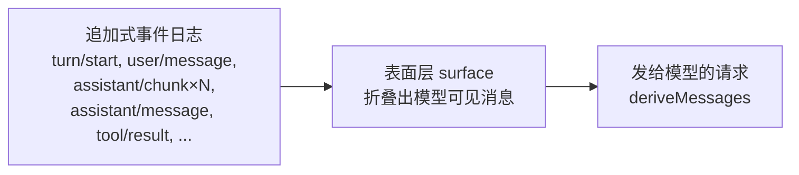

# 第 11 章 会话与记忆：让 Agent 可复现

> **本章目标**
> 1. 理解"事件溯源（event sourcing）"式会话日志的设计；
> 2. 吃透 dsh 的核心不变量："模型可见 ⟺ 可记录"；
> 3. 了解表面层（surface）、格式版本（format version）等配套机制；
> 4. 对照 pi / codex 的会话持久化方案。

## 11.1 生活化开场：记账本 vs 会议纪要

假设你要复盘"上周那个 Agent 为什么犯了个错"。你希望手里有什么？

- **糟糕的答案**：只有一份"最后结果"——"它把文件删了"。你不知道它**为什么**删，
  它之前看到了什么、调了什么命令。
- **理想的答案**：一本**流水账**——"上午 10:00，用户说 X；10:01，模型说要跑
  `rm -rf build`；10:01:30，命令执行返回……"。每个细节都在，随时能回放。

**会话持久化的两种思路，正好对应这两种答案**：

| 思路 | 存什么 | 优点 | 缺点 |
|------|--------|------|------|
| **状态快照（snapshot）** | 只存"当前状态" | 简单、省空间 | 无法回放过程、无法审计"为什么" |
| **事件日志（event log）** | 存"每一个发生的事件" | 可回放、可审计、可重建 | 复杂、占空间 |

dsh 选择的是**事件日志**（而且是"追加式"的：只追加、不改写）。
这是它所有"严谨性"的地基。codex 也走类似路线（持久化历史 + 世界状态）。
pi 的运行时本身不持久化，但提供了 `session-backends`（SQLite）这类**可选后端**，
把"是否持久化"留给了使用方。

## 11.2 dsh 的会话：事件溯源（Event Sourcing）

dsh 的会话模块是 `packages/core/session/`。它的设计总结在 `index.ts` 顶部注释里：

> **Event-sourced session service: append-only session log, in-memory store, and
> the derived LLM message history.**

翻译：**事件溯源的会话服务——追加式会话日志、内存存储、以及"派生的"LLM 消息历史。**

三个关键词，逐一展开：

### ① 追加式日志（append-only log）

每次发生一件事，就 `session.append(type, data, opts)` 追加一条事件。看第 7 章
我们在循环里见过的那些调用：

```ts
this.session.append('turn/start', { turn })                 // 回合开始
this.session.append('step/start', { turn, step })           // 步骤开始
this.session.append('user/message', message, ...)           // 用户消息
this.session.append('assistant/chunk', { turn, step, chunk })  // 每个流式块！
this.session.append('assistant/message', {...}, { sourceEventSeqs: chunkSeqs })  // 完整 assistant 消息
this.session.append('step/end', { turn, step })             // 步骤结束
this.session.append('turn/end', { turn, reason })           // 回合结束
```

**连"每个流式块"都记**——这是"极致可复现"的表现：任何一次模型输出，都能从
日志里精确回放。日志是唯一的真相源（source of truth），内存里的任何东西
都只是它的"派生视图"。

### ② 从日志派生消息历史（derive）

模型需要的消息数组不是直接存的，而是**从日志派生**的。第 7 章 `step()` 里
有一行：`this.session.deriveMessages()`。它的工作就是遍历日志中
"会产生消息的事件"，把它们折叠成消息数组。这就是 `surface.ts` 里
`SURFACE_EVENT_TYPES`（`user/message`、`assistant/message`、`tool/result`）
的用途——**只有这三种事件会进入"模型可见的表面（surface）"**。



**"表面层"（surface）** 是 dsh 的一个精妙概念：日志是"全部真相"，
但模型不需要看到所有细节（比如 `turn/start` 这类管理事件）。表面层负责
**从日志中挑选、折叠出模型真正看到的那份消息**。`surface.ts` 里还有
`foldSurface`、`isSurfaceEvent` 等函数处理这件事，甚至支持"替换操作"
（`surfaceOp: 'replace'`），用于压缩后**用摘要替换旧消息**（和上一章呼应）。

### ③ 不变量："模型可见 ⟺ 可记录"

dsh 的 AGENTS.md 里有一条铁律，值得在这里反复强调：

> **Model-visible ⟺ logged**：anything that reaches a model request must be
> reconstructable from the session log.

翻译：**任何到达模型请求的东西，都必须能从会话日志重建。**

这条不变量带来两个直接后果：

1. **请求是日志的函数**：`buildRequest` 构造的请求（第 7 章）纯由
   `deriveMessages()` 等日志派生 + 深冻结。没有"偷偷塞进请求但没记录"的内容。
2. **调试就是回放**：出了任何问题，打开日志就能精确知道"当时模型看到了什么"。
   这比任何日志打印都可靠——因为打印可能漏，日志（作为唯一真相源）不会。

> **想想 pi**：pi 的 `context.messages` 是内存数组，模型看到什么取决于数组内容。
> 如果某个钩子往数组里 push 了内容但没通知任何人，你就"死无对证"了。
> dsh 把"记录"和"派生"分开，从根本上消灭了这类问题。

## 11.3 配套机制：格式版本与快照

### 格式版本（format version）

日志是持久化的，就可能跨版本读取。dsh 用 `SESSION_FORMAT_VERSION`（当前为 `0`）
标记日志格式。AGENTS.md 里说：

> SQLite uses monotonic `SCHEMA_VERSION`; `dsh-session` keeps
> `SESSION_FORMAT_VERSION` at `0` with no compatibility promise.

**`0` 意味着"没有兼容承诺"**——格式变就整体升级（因为还没有外部消费者，
这是 dsh "基础优先于兼容"的立场）。但"有版本号"这件事本身很重要：
一旦有消费者，就能靠版本号做迁移。

### 快照（snapshot）

纯事件日志无限增长会很占空间、回放很慢。生产系统通常会用
**周期性快照 + 事件增量**的组合：隔一段时间把状态折叠成一个快照存档，
之后只记增量事件；要重建时从最近快照开始 + 重放增量。
（dsh 的存储/会话插件里有相关实现；codex 的 thread store 同样考虑快照。）

## 11.4 codex 的会话：持久化 + 世界状态

codex 的会话（`codex-rs/core/src/session/`、`thread_store`）也是持久化的，
但比 dsh 多了一层：**世界状态（world state）**。

- **会话历史**：`record_conversation_items` 持久化每个 response item；
- **世界状态**：`record_context_updates_and_set_reference_context_item` 持续
  追踪文件系统、环境、终端的当前状态；
- **用途**：压缩时重建环境（第 10 章）、展示 diff（`TurnDiffTracker`）、
  恢复会话。

codex 的 `clone_history()` 和 dsh 的 `deriveMessages()` 思想一致：
**每次请求的输入从持久化历史派生**。codex 还额外持久化"回合元数据"
（`turn_metadata.rs`：模型、时间、usage 等），用于审计与遥测。

## 11.5 pi 的会话：内存优先，后端可选

pi 的核心循环**不持久化**（这是刻意的简）。但它为"需要持久化的人"提供了
`packages/session-backends/`（SQLite 等）。也就是说：

- **开箱即用**：`context.messages` 内存数组，最简单；
- **需要时**：接上 session-backends，把会话存进 SQLite；
- **哲学**：持久化是"可选能力"，不是"核心不变量"。

对比三库的会话哲学：

| 维度 | pi | dsh | codex |
|------|-----|-----|-------|
| 运行时会话 | 内存数组 | 内存 store + 日志 | 持久化历史 |
| 持久化 | 可选后端 | 事件日志（核心） | 内建（核心） |
| 可回放 | 否 | **是（逐块回放）** | 是 |
| "模型可见⟺可记录" | 无保证 | **核心不变量** | 隐含（历史派生） |
| 世界状态 | 无 | 无（有上下文投影） | 有 |
| 格式版本 | 无 | `SESSION_FORMAT_VERSION` | 线程存储版本 |

## 11.6 为什么"可复现"这么值钱

最后聊一个实践问题：**可复现到底值多少钱？** 三个场景：

1. **调试"模型为什么这么答"**：有了日志回放，你可以把"模型当时看到的完整输入"
   原样重发一次，看是否复现。没有日志，你只能猜。
2. **审计与合规**：Agent 改过什么文件、跑过什么命令，全在日志里。出事故时
   这是唯一的客观证据。
3. **测试**：dsh 的"快照测试"（snapshot test）依赖可复现——把一次真实对话的
   日志保存下来，无 key 时也能重放、对比输出。**可复现性直接决定了测试能不能写。**

这也是为什么 dsh 愿意为"日志 + 派生"付出复杂度——**它不是可有可无的装饰，
而是调试、审计、测试的地基**。

## 11.7 本章小结

- 会话持久化有"快照"与"事件日志"两种思路，dsh/codex 选事件日志（可回放）；
- dsh 会话 = 追加式日志 + 内存 store + 派生消息历史；
- **"模型可见 ⟺ 可记录"** 是 dsh 的核心不变量：请求是日志的函数；
- 表面层（surface）从日志折叠出模型可见消息，支持压缩替换；
- 格式版本（SESSION_FORMAT_VERSION）为日志演进提供迁移依据；
- codex 在历史之上加了"世界状态"；pi 把持久化做成可选后端。

## 动手练习

1. **看一条真实日志**：在 dsh 跑一个简单任务，打开会话日志，
   找出"一次模型请求"对应哪些事件（request/header、user/message、
   assistant/chunk、assistant/message……），确认它们能拼出完整请求。
2. **试 deriveMessages**：读 `packages/core/session/src/surface.ts`，
   数一数 `SURFACE_EVENT_TYPES` 里有哪些类型，想想要不要加
   `turn/start`？（提示：模型不需要看到"回合开始"这种管理事件。）
3. **思考题**：如果一个 Agent 框架只存"最终结果"不存日志，
   当用户问"你上次为什么删了这个文件"，你能回答吗？为什么？

---

**下一章**：[第 12 章 扩展 Agent：插件、技能与 MCP](12-能力扩展.md)
有了可靠的"记忆"，Agent 还缺"能力"。本章看三库如何扩展 Agent：插件、技能、MCP。
