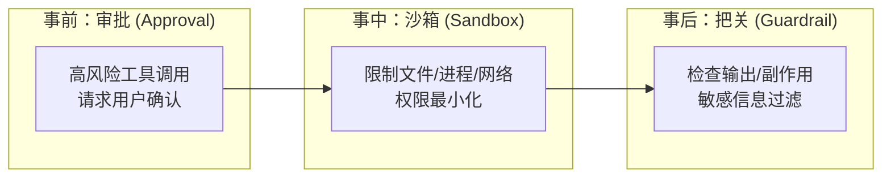
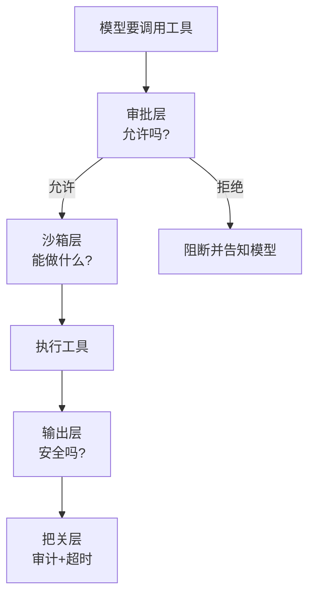

# 第 13 章 安全边界：沙箱与权限

> **本章目标**
> 1. 理解 Agent 安全问题的根源：它拥有"执行权限"，但判断力有限；
> 2. 掌握三大安全机制：权限审批（approval）、沙箱（sandbox）、输出把关（guardrail）；
> 3. 看懂 codex 的沙箱与审批体系，以及 dsh 的沙箱策略层；
> 4. 建立"纵深防御"的安全心智。

## 13.1 生活化开场：一位"能力很强但需要盯着"的实习生

想象一位技术很强的实习生：他能跑任何命令、改任何文件、发任何请求。
但他偶尔会"理解错"或"用力过猛"——比如他以为 `rm -rf` 是删临时文件，
结果把整个项目删了。

你会怎么"保护公司"？

1. **关键操作要审批**：删库、上线、动生产配置——先问你；
2. **限制他的活动范围**：只能在一个"工位"（沙箱）里活动，碰不到别的系统；
3. **结果抽查**：他干完活，你 review 一下改了什么。

Agent 的安全设计，就是这三件事的工程化。**Agent 安全问题的根源**很本质：

> **Agent 有"行动能力"（能执行代码、改文件、联网），但它的"判断"是概率性的，
> 可能犯错或被恶意输入诱导。安全设计必须假设"它会犯错"。**

## 13.2 安全三大机制总览

| 机制 | 回答的问题 | 触发时机 |
|------|-----------|---------|
| **审批（approval）** | 这个操作我能不能做？ | 工具调用前 |
| **沙箱（sandbox）** | 这个操作能做到什么程度？ | 工具执行时 |
| **把关（guardrail）** | 输出是否安全合规？ | 输出回传/展示时 |

## 13.3 审批（Approval）：给高风险操作"上锁"

不是所有工具调用都需要审批——每次都问会烦死用户。**审批的原则是：
低风险自动放行，高风险请示用户。** 怎么判定风险？两个维度：

1. **命令本身**：`ls` 安全，`rm -rf` 危险；
2. **作用范围**：写自己的项目目录还行，动系统目录危险。

### codex 的审批体系

codex 有非常完整的审批体系（`tools/approvals.rs`、`guardian/`）：
- **命令规范化**：`canonicalize_command_for_approval` 把用户输入的命令"标准化"
  （展开别名、解析路径），再做审批判断——避免用户用别名绕过检查；
- **审批策略**：`with_cached_approval` 缓存已批准的操作（一次批准，一段时间内有效）；
- **审批钩子**：`run_permission_request_hooks` 让用户自定义审批规则
  （比如"`npm install` 自动允许"）；
- **Guardian 审查器**：`guardian/` 是一个"审查服务"，复杂/高风险的审批
  会路由给它做二次审查。

### dsh 的审批与交互

dsh 的 `packages/interaction/` 提供了完整的审批能力：
`user-approval`（用户审批）、`tool-ask-user`（工具反过来向用户提问）、
`permission-presets`（权限预设）。dsh 还支持"**工具执行前向用户提问**"——
比如一个工具需要用户提供信息，可以调用 ask-user 暂停等待用户输入。

## 13.4 沙箱（Sandbox）：限制"能做到什么程度"

审批是"允许/禁止"；沙箱是"即使允许，也限制活动范围"。核心是
**最小权限原则**：只给完成工作所需的最小权限。

### codex 的沙箱

codex 的沙箱在 `codex-rs/core/src/sandboxing/` + `codex-sandboxing` crate，
支持多种沙箱后端：

| 后端 | 平台 | 特点 |
|------|------|------|
| **Seatbelt / seatbelt** | macOS | 系统级沙箱，限制文件读写、网络、进程 |
| **bubblewrap（bwrap）** | Linux | 命名空间隔离 |
| **Windows Sandbox / AppContainer** | Windows | 受限令牌 + 文件系统覆盖 |

codex 的沙箱模型很精细，核心概念：

- **SandboxPermissions**：一组权限位（文件系统读、写、网络……）；
- **网络代理**：`codex_network_proxy` + `ManagedNetworkSandboxContext`——
  连"网络"也通过代理控制，可以允许/拒绝特定域名；
- **执行策略**：`exec_policy/model_policy.rs` 定义"模型能做什么"
  （能读哪些路径、能否写、能否联网），在**请求层**就约束模型能用的工具能力。

一个关键机制是 **`/codex-sandbox` 环境变量 + 命令转换**：
沙箱系统会把"要执行的命令"**转换成"在沙箱内执行的命令"**
（`SandboxExecRequest`），并注入环境变量告诉命令"你在沙箱里、网络被禁"。

### dsh 的沙箱

dsh 的沙箱是**策略驱动**的（`packages/sandbox/`）：

- `sandbox-policy`：**沙箱策略的唯一归属方**（`ctx.sandboxPolicy`），
  负责解析"当前会话应该用什么沙箱模式、工作区写根目录在哪"；
- `sandbox-local`：本地沙箱实现（基于 macOS 的 landlock / 权限模型），
  还有原生层 `native/@deepseek-ai/node-addon-landlock-run` 做真正的
  **landlock 强制**；
- 沙箱模式（`SandboxMode`）包括：`off`（关）、`read-only`（只读）、
  `workspace-write`（只能写工作区）、`full`（完全）。

dsh 的一个细节值得学习：**沙箱策略会被写进"运行时上下文快照"并记入会话日志**。
因为"模型请求时沙箱是什么模式"也是模型可见的一部分——回放时要能重建
"当时模型处于什么权限下"。这是 dsh "模型可见 ⟺ 可记录"哲学在安全层的延伸。

### pi 的安全立场

pi 的 README 明确说明：**pi 没有内置权限系统**，默认以启动它的用户权限运行，
如果需要隔离请用容器化（Docker/Gondolin/OpenShell）。这是一个清晰的
"安全边界外包"决策——不内置，而是把隔离交给底层容器。

## 13.5 把关（Guardrail）：输出与副作用检查

审批管"能不能做"，沙箱管"能做到什么程度"，**把关管"做出来的东西安全吗"**：

- **敏感信息过滤**：防止模型把 API key、密码、个人信息输出出去；
- **副作用审查**：运行前后对比，看改了哪些文件（codex 的 `TurnDiffTracker`）；
- **内容安全**：过滤危险指令、注入攻击。

codex 的 `guardian/` 既是审批审查器，也是把关的一环；
dsh 的 `packages/guard/`（"loop-hygiene + tool-timeout"）负责循环卫生和
工具超时——**超时本身也是一种安全机制**：防止工具卡死或无限运行。

## 13.6 纵深防御：安全不是单点

最后，把三种机制串起来，理解"**纵深防御**"：任何一个环节都可能被绕过，
所以要层层设防。

一个真实的安全事故，往往需要"模型被诱导 + 审批被绕过 + 沙箱没有限制 +
输出没被检查"才会发生。**设计目标不是"消灭某一个风险"，而是让"突破所有层"
变得几乎不可能。**

## 13.7 本章小结

- Agent 安全问题的根源：有执行能力、但判断是概率性的，必须假设会犯错；
- 三大机制：审批（能不能做）、沙箱（能做到什么程度）、把关（输出安全吗）；
- codex：沙箱多后端（seatbelt/bwrap/Windows）+ 网络代理 + 审批缓存 + Guardian；
- dsh：策略驱动沙箱（sandbox-policy）+ landlock 原生层 + 交互审批；
- pi：不内置，容器化外包；
- 用"纵深防御"思考：层层设防，让突破所有层几乎不可能。

## 动手练习

1. **查沙箱模式**：在 dsh 里 `grep -rn "SandboxMode" packages/sandbox/`，
   找出所有沙箱模式，思考各自适合什么场景。
2. **试审批**：在 codex 里配置一个低风险自动放行的审批规则
   （比如允许 `npm install`），再触发一个高风险命令，观察审批流程。
3. **读超时**：在 dsh 的 `packages/guard/` 里找工具超时逻辑，看看超时后
   会发生什么（工具被终止？模型收到什么？）。
4. **思考题**：为什么"沙箱模式"也要写进会话日志？结合第 11 章的
   "模型可见 ⟺ 可记录"思考。

---

**第三部分（进阶篇）到这里结束。** 你已经理解了 Agent 产品化的四块拼图：
上下文管理、会话与记忆、能力扩展、安全边界。

接下来进入最后一部分——**实践篇**：把前面所有知识用起来，
先动手写一个你自己的最小 Agent，再看一个三库协作的综合案例。

**下一章**：[第 14 章 动手：从零写一个最小 Agent](../04-实践篇/14-最小Agent.md)
