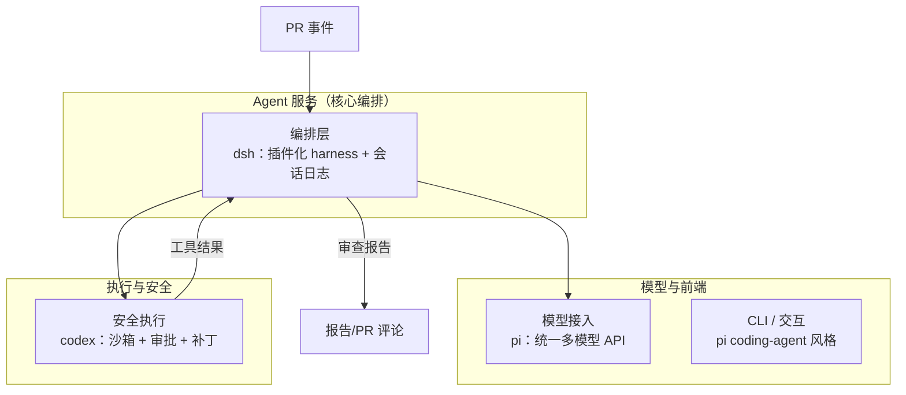
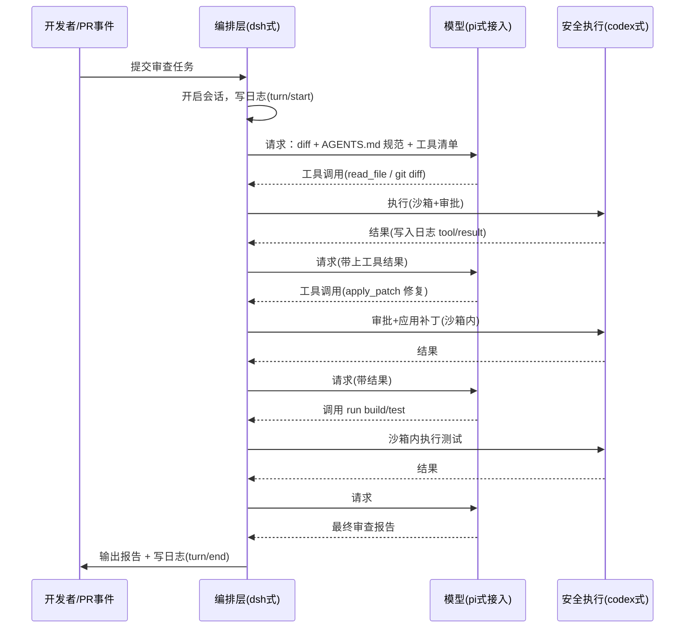
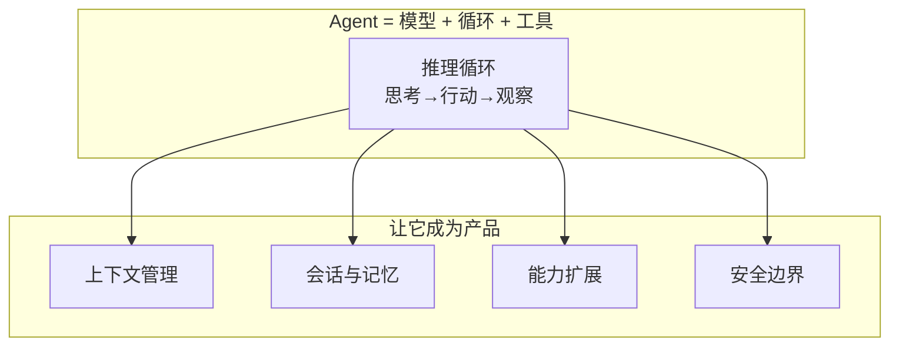

# 第 15 章 综合案例：让三个代码库协作

> **本章目标**
> 1. 把全书知识串成一个完整的、可落地的综合案例；
> 2. 学会在真实项目里"借用"三个代码库的设计模式；
> 3. 练习"从需求到架构"的 Agent 产品设计方法；
> 4. 理解"不是所有 Agent 都要自己从零写"。

## 15.1 案例设定

假设你所在的公司想做一个内部工具：**"自动代码审查 + 修复助手"**。
需求如下：

> 开发者在 PR 提交后，把这个助手"喊"来，它要：
> 1. 读取 PR 的 diff 和相关文件；
> 2. 按团队规范（AGENTS.md、lint 规则）审查，指出问题；
> 3. 对可自动修复的问题，给出并应用修改（生成补丁）；
> 4. 跑一遍构建/测试确认修复有效；
> 5. 输出一份审查报告。

这是一个**典型的生产级 Agent 任务**：有输入（PR）、有工具（读文件/改文件/跑命令）、
有循环（审查→修复→验证→报告）、有安全诉求（不能乱改、要审计）。

**关键问题：你打算"从零写"还是"用现成框架"？怎么选？**
——这正是我们三章代码精读沉淀下来的能力：**你已经能评估 Agent 框架、规划架构、
并读懂任何一套 Agent 代码。** 现在用这个能力做一次"架构师"练习。

## 15.2 第一步：需求 → 能力清单

先把需求翻译成 Agent 能力（回顾第 1 章公式：Agent = 模型 + 循环 + 工具）：

| 需求 | 需要的 Agent 能力 | 对应章节 |
|------|------------------|---------|
| 读 diff / 文件 | 读文件、git 工具 | 第 3 章 |
| 按规范审查 | 系统提示词注入 AGENTS.md / lint 结果 | 第 10、12 章 |
| 生成补丁 | 编辑/补丁工具 | 第 3 章 |
| 跑构建/测试 | 命令执行（bash）工具 | 第 3、13 章 |
| 输出报告 | 最终回答结构化 | 第 5 章 |
| 别乱改、可审计 | 审批 + 沙箱 + 会话日志 | 第 13、11 章 |

**如果用一个现成的框架**（比如 codex 或 dsh），这份能力清单大部分是"开箱即用"的——
你只需要：配置模型、挂上工具、注入规范文档、设置审批与沙箱、接上会话日志。
**这正是指南核心的洞察：能跑起来的 Agent 只是一个循环；要变成产品，需要第 10–13 章
那四块拼图。而三库已经帮你把拼图拼好了一半。**

## 15.3 第二步：架构选型——三个代码库各派什么用场

这是本章最有意思的部分：**在一个真实的"三库协作"架构里，让每个库做它最擅长的事。**

### 分工逻辑：各用所长

| 组件 | 用谁 | 为什么（引用前面的对比） |
|------|------|------------------------|
| **核心编排** | **dsh** | 需要插件化（加工具/加规范不碰核心）、持久化会话（可审计、可回放，第 11 章）、瀑布拦截（安全策略注入，第 7 章） |
| **模型接入** | **pi** | 需要"一个接口接多家模型"（第 4 章），pi 的 provider 生态最丰富，换模型零改核心 |
| **安全执行** | **codex 的沙箱/补丁** | 需要跑命令、改文件但有强约束（第 13 章）：沙箱 + 审批 + diff 追踪，codex 最成熟 |
| **交互/报告** | pi coding-agent 风格 | 事件流驱动 UI（第 6 章），边跑边给开发者反馈 |

**诚实地说**：现实中你未必真的把三个库"拼在一起"（那是三个独立进程/系统），
但这个练习的意义是**学会把每个库的"最佳模式"吸收进你自己的架构**：
- 用 dsh 的**会话日志 + 瀑布**思路设计你的编排层；
- 用 pi 的**统一模型抽象 + 事件流**思路设计你的接入与 UI；
- 用 codex 的**沙箱 + 审批 + diff 追踪**思路设计你的安全执行层。

## 15.4 第三步：核心流程设计

现在我们用"三库思维"设计这个 Agent 的核心流程（骨架仍是第 5 章的循环，
但我们给每一步都加了"保险"）：

注意每一步模型请求之间，我们都在**写会话日志**（dsh 式）——出了任何问题，
可以回放"模型当时看到了什么"。这是前面第 11 章讲的可复现性在真实产品里的价值。

## 15.5 第四步：把三个"难点"做扎实

设计完流程，把最容易翻车的三个点单独拎出来，用三库的成熟方案解决：

### 难点 1：diff 与补丁的正确性（借用 codex 的 apply_patch）

修复代码时，让模型"整文件重写"非常危险（容易引入无关改动）。正确做法是
**用统一 diff 格式的补丁工具**，让模型只输出"要改哪几行、改成什么"。
codex 的 `apply_patch` 正是为此设计的（第 3 章提过它的 description 会引导模型
"只改该改的"）。我们在自己的工具里，要模仿它：
- 工具 schema 的 `description` 明确写"用于修改文件，输出 unified diff，而不是重写全文"；
- 执行时**校验**：只允许改动 diff 中声明的行，拒绝无关修改。

### 难点 2：跑测试的安全（借用 codex 的沙箱）

"自动跑测试"意味着让 Agent 执行任意命令——这是最高风险点。解决方案：
- **沙箱**（第 13 章）：在容器/沙箱里跑测试，限制文件与网络；
- **审批**：构建/测试命令默认放行，但"删除、安装依赖、写系统目录"必须审批；
- **超时**：给每个命令设超时，防止卡死（dsh 的 guard 插件思路）。

### 难点 3：审查规范的一致性（借用 dsh 的系统提示分片）

团队规范（AGENTS.md、lint 规则、代码风格）要稳定地注入每次请求。用 dsh 的
"分片 + 排序"思路：把"框架身份"（-100）"审查人设"（0）"工具指南"（100-199）
"项目规范"（动态 section）分开，排序拼接，动态部分每回合重算（第 10 章）。
这样"改规范"只是"改一个 section"，不动 Agent 核心。

## 15.6 第五步：验收与复盘

上线前，用三库各自的"质检思维"做一遍验收：

| 维度 | 检查项 | 借用谁的思维 |
|------|--------|-------------|
| **可复现** | 任意一次审查，能否从日志重建"模型看到了什么"？ | dsh（第 11 章） |
| **可测试** | 能否用假模型回放日志做快照测试？ | dsh 快照测试（第 11 章） |
| **可观测** | 循环的每个状态是否都有事件对外广播？ | pi 事件流（第 6 章） |
| **安全** | 高危操作是否都被审批/沙箱约束？ | codex（第 13 章） |
| **健壮** | 模型 API 抖动能否自动重试？上下文触顶能否压缩？ | codex 重试/压缩（第 8、10 章） |

**如果这些检查都过，恭喜——你从"能写一个最小 Agent"（第 14 章），
成长为"能设计一个生产级 Agent 产品"了。**

## 15.7 全书收官：你学会的三件事

回顾整本书，我们希望你已经掌握了三件事：

1. **看透循环**：任何 Agent 都是"思考—行动—观察"的循环，差别只在保险；
2. **读懂代码**：pi（可读）、dsh（可扩展）、codex（可生产），三库对照着读，
   再遇到任何 Agent 框架都不再是黑盒；
3. **会做产品**：上下文管理、会话与记忆、能力扩展、安全边界——把循环变成产品
   的四个支柱。

**如果你只带走一张图，是这张：**

## 15.8 最后的作业

1. **给本书纠错/补充**：读完全书，你发现哪个代码细节需要更正？
   （代码会演进，请以你本地仓库为准。）
2. **写你自己的 Agent**：基于第 14 章的代码，选一个真实小任务
   （比如"整理我的下载目录"），按第 15 章的三库思维给它加"保险"。
3. **选型练习**：如果公司要做一个"客服知识库 Agent"，你会在 pi / dsh / codex
   之间怎么选、为什么？写一份一页纸的选型说明。

---

## 全书结语

谢谢你把这本书读完。从"一个 Agent 到底是什么"到"我能自己设计生产级 Agent"，
这段路不容易，但值得。**Agent 技术最大的门槛不是模型，而是环绕模型的工程**——
而你现在已经拥有了读懂任何 Agent 工程的钥匙。

接下来，附录里有**术语表**（随时查）、**三库对照表**（速查）、**练习答案**（自我检验）
和**延伸资源**（继续深入）。祝你写出更好的 Agent。🚀

---

**下一部分**：[附录 A 术语表](../附录/A-术语表.md)
