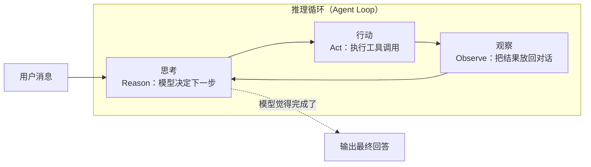
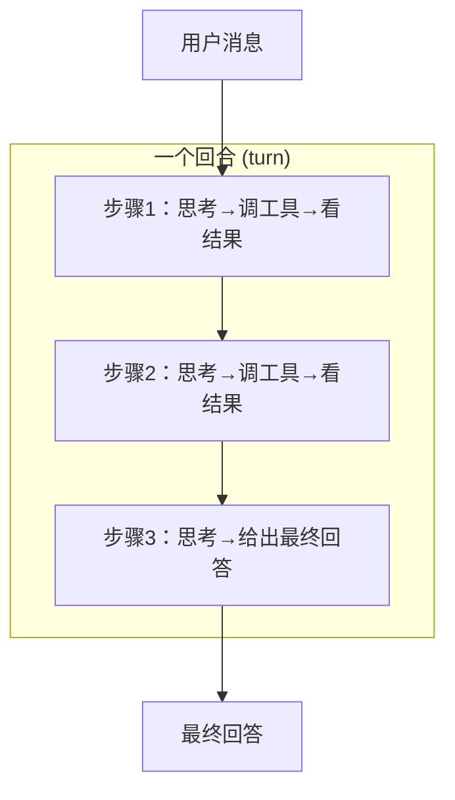

# 第 5 章 推理循环：思考—行动—观察

> **本章目标**
> 1. 彻底理解"推理循环（Agent Loop / ReAct）"这个核心概念；
> 2. 掌握两个重要概念：回合（turn）与步骤（step）；
> 3. 学会读循环代码：关注"继续条件"与"结束条件"；
> 4. 建立从"最小循环"到"生产循环"的演进观。

## 5.1 生活化开场：一位"逐步确认"的助理

假设你请了一位助理帮你写一份季度报告。他不会一口气写完交给你，而是：
"我先把数据整理出来 → 我看一眼 → 我写提纲 → 我看一眼 → 我写正文 → 我检查一遍 → 交给你"。

每完成一个小动作，他就**把结果记下来，看一眼当前状态，再决定下一步**。
直到他觉得"可以交了"，才停下来。

这个"**做事 → 看结果 → 决定下一步 → 再做事**"的循环，就是 Agent 最核心的机制——
**推理循环（Agent Loop）**。学界给它起了个名字叫 **ReAct**：**Re**ason（思考）+ **Act**（行动）。
模型"思考"（决定下一步调什么工具、怎么调）→ "行动"（执行工具）→ 看到结果（观察）→
再"思考"……如此往复。



## 5.2 两个必须分清的概念：回合（turn）与步骤（step）

不同代码库对"循环的层级"命名不同，但几乎所有成熟 Agent 都有**两层循环**。
请务必先分清这两个词，因为它们贯穿后面三章代码精读：

| 概念 | 通俗解释 | 典型触发点 |
|------|---------|-----------|
| **回合（turn）** | 从"一条用户消息进来"到"Agent 给出最终回答"的**整个过程** | 用户发消息 |
| **步骤（step）** | 回合内的一次"思考→行动→观察"小循环 | 模型调了一次工具 |



一个回合包含多个步骤；一个步骤通常包含一次"模型输出"和若干次"工具执行"。
**模型每被请求一次，就产生一个步骤（或一个"半步骤"）。** 一次请求里模型可能
输出文字+多个工具调用，我们仍算一个步骤。

为什么这个区分重要？因为：
- **回合**决定"生命周期"：什么时候开始（用户说话）、什么时候结束（任务完成/出错/被中断）；
- **步骤**决定"推进单位"：什么时候该把模型历史再发一次、什么时候该把工具结果加进去。

后面你会看到：pi 的循环叫"inner loop / outer loop"，dsh 的叫"turn / step"，
codex 的叫"turn / sampling request"——本质都是"外层回合 + 内层步骤"。

## 5.3 一个最小推理循环的"骨架代码"

在进入真实代码前，我们先写一个**最小可运行的伪代码**，把循环的骨架钉死。
所有真实代码库的循环，都是这个骨架加各种细节：

```python
def agent_loop(user_message, system_prompt, tools, llm):
    messages = [system_prompt, user_message]   # 会话历史
    while True:
        # 1. 把历史和工具清单发给模型
        reply = llm.stream(messages=messages, tools=tools)

        # 2. 从回复里找出所有"工具调用"
        tool_calls = extract_tool_calls(reply)
        if not tool_calls:
            # 3a. 没有工具调用 → 任务完成，返回最终回答
            return reply.final_text

        # 3b. 有工具调用 → 逐个执行，把结果放回历史
        for call in tool_calls:
            result = execute(tool=call.name, args=call.arguments)
            messages.append(tool_result_message(call.id, result))

        # 4. 回到 while 顶部，再次请求模型（它会看到工具结果）
```

**请你现在就合上书，把这个骨架默写一遍。** 因为后面三章的代码精读，
你会反复看到这个骨架以不同面目出现。记住四个动作：

1. 发请求（带历史 + 工具清单）；
2. 找工具调用；
3. 有 → 执行、放回历史、继续循环；
4. 没有 → 返回最终回答。

## 5.4 循环里真正难的三件事

骨架很简单，但真实代码几百上千行，难在给这个骨架"加保险"。三件事最难：

### 第一难：怎么判断"该结束了"

循环最怕**永远不结束**（死循环）。真实代码里，结束条件远比"没有工具调用"复杂：

- 模型连续多次输出相同工具调用（**卡死**）——要检测并打断；
- 工具结果永远失败，模型反复重试——要限制重试次数；
- 输出超长（`max-tokens` 触发）——要降级处理；
- 上下文塞满——要压缩后再继续；
- 用户手动中断——要能安全取消。

**判断"结束"往往不是一步，而是一连串 `if`。** 读循环代码时，
把目光集中在"这个循环什么条件下会 break / return / exit"，你就能抓住它的灵魂。

### 第二难：工具执行的各种意外

- 参数 JSON 残缺（第 3 章讲过）；
- 工具执行超时 / 崩溃；
- 工具副作用不可回滚（删了文件怎么办）；
- 并行工具的竞态。

### 第三难：上下文与成本

每循环一次，历史就变长一点。长到一定程度，要么超模型上下文窗口，要么花钱如流水。
所以生产级 Agent 有**上下文压缩（compaction）**、**预算（budget）**等机制（第 10 章）。

## 5.5 从"最小"到"生产"：一个演进谱系

把三章的代码精读提前放一张对照表，让你先看到"演进"的轮廓：

| 实现 | 大致形态 | 加了哪些"保险" |
|------|---------|---------------|
| 最小循环（上面伪代码） | 一个 `while True` | 无 |
| **pi**（第 6 章） | 双层 `while`（外层回合 / 内层步骤） | 事件流、中止信号、转向消息（steering）、串并行工具 |
| **dsh**（第 7 章） | turn/step 状态机 + 会话日志 | 会话持久化、错误结构化、请求冻结、瀑布拦截、收件箱 |
| **codex**（第 8 章） | run_turn 回合循环 + 采样循环 | 重试、上下文压缩、沙箱、预算、世界状态、多智能体 |

注意一个反直觉的事实：**"保险"越多，代码越难读，但核心逻辑没变。**
读真实代码时，如果你被细节淹没，请不断回到这个骨架：*这一步是在"发请求"？
还是在"判断结束"？还是在"执行工具"？*

## 5.6 三库对照：各自的"循环入口"

| 代码库 | 外层（回合）入口 | 内层（步骤）入口 | 主要文件 |
|--------|----------------|----------------|---------|
| pi | `runLoop`（`runAgentLoop`/`runAgentLoopContinue`） | inner `while` + `streamAssistantResponse` | `packages/agent/src/agent-loop.ts` |
| dsh | `ReactLoopAgent.turn()` | `ReactLoopAgent.step()` | `packages/core/agent-loop/src/agent.ts` |
| codex | `run_turn`（`tasks/regular.rs` 的 `loop` 调用它） | `run_sampling_request` | `codex-rs/core/src/session/turn.rs` |

## 5.7 本章小结

- Agent 的核心是 **推理循环（ReAct：思考→行动→观察）**；
- 分清 **回合（turn）** 与 **步骤（step）** 两层循环；
- 最小循环骨架：发请求 → 找工具调用 → 有则执行放回历史并继续 / 无则返回最终回答；
- 真实循环的复杂度来自"加保险"：结束判断、错误处理、上下文管理；
- 读循环代码的秘诀：始终回到骨架，关注"哪里会 break / return"。

## 动手练习

1. **默写骨架**：不看 5.3 节，把最小循环用你熟悉的语言写一遍。
2. **画状态图**：画一个回合（turn）的状态机，包含：等待用户消息、发请求、
   执行工具、回合完成、出错、被中断这几个状态，以及状态之间的迁移。
3. **预告阅读**：打开 pi 的 `packages/agent/src/agent-loop.ts`，先不读细节，
   只数一数文件里有几个 `while`，猜一猜各自在循环什么。（第 6 章揭晓）

---

**下一章**：[第 6 章 代码精读（一）：pi 的推理循环](./ch06-code-pi.md)
现在开始真正的"逐行读代码"。第一站选 pi——因为它最简洁、最像教科书。
