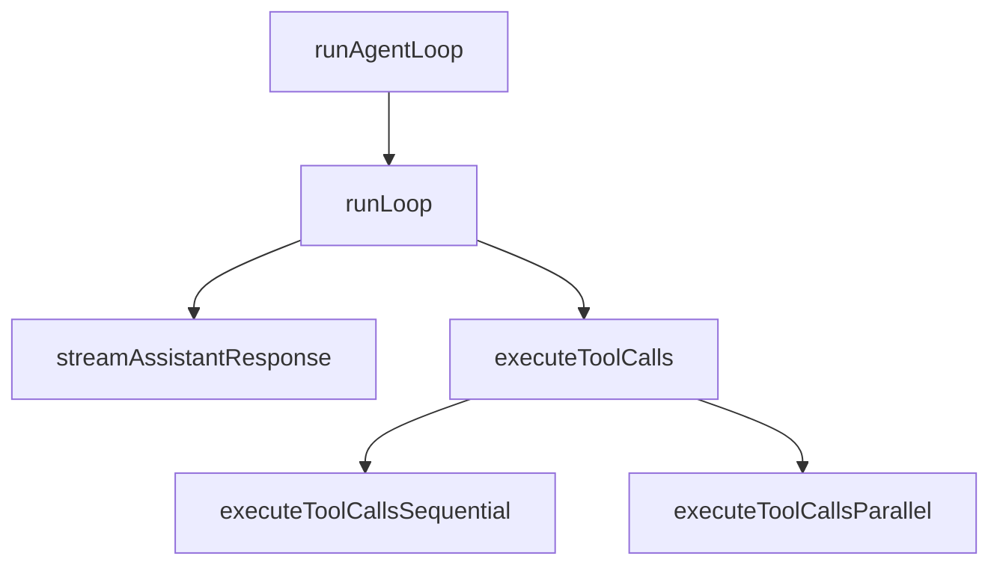
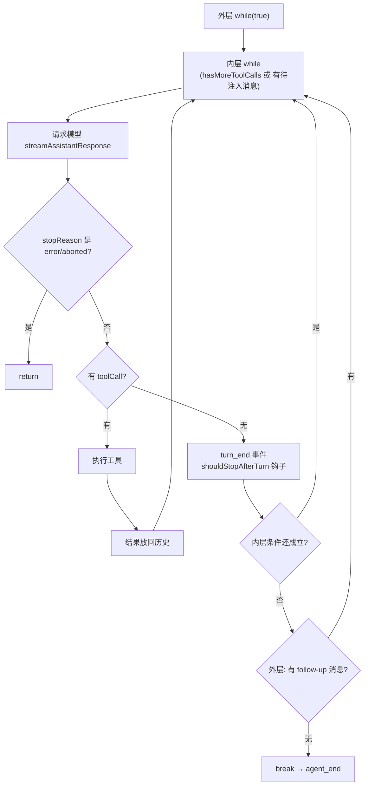

# 第 6 章 代码精读（一）：pi 的推理循环

> **本章目标**
> 1. 逐行读懂 pi 的推理循环实现（`packages/agent/src/agent-loop.ts`）；
> 2. 看懂"双层循环"：外层回合、内层步骤；
> 3. 看懂模型调用的"流式事件处理"；
> 4. 学会从"事件流"的角度理解 Agent 的对外输出。

这是全书第一次"逐行读代码"。请打开 pi 仓库的
`packages/agent/src/agent-loop.ts`（约 800 行），跟着本章一节节读。
建议：**先读本节，再对着文件读一遍**。

## 6.1 文件总览：先看地图，再走迷宫

`agent-loop.ts` 是 pi Agent 运行时的"引擎"。它由以下主要部分组成：

| 行号区间 | 内容 | 作用 |
|---------|------|------|
| 31–54 | `agentLoop` | 低层入口：把整个循环包装成一个"事件流"（EventStream） |
| 64–93 | `agentLoopContinue` | 低层入口：从当前上下文继续循环（用于重试） |
| 95–118 | `runAgentLoop` | 高层入口：带新用户消息启动循环 |
| 120–143 | `runAgentLoopContinue` | 高层入口：不带新消息继续循环 |
| 155–275 | `runLoop` | **核心循环本体**（双层 while） |
| 281–372 | `streamAssistantResponse` | 调用模型、处理流式事件 |
| 381–580 | `executeToolCalls` 系列 | 执行工具（串行/并行） |
| 580–796 | `prepareToolCall` 等 | 工具调用前的准备与校验 |

**先看两个核心函数的调用关系**：



## 6.2 入口函数：runAgentLoop 与 runAgentLoopContinue

先从 `runAgentLoop`（95 行）看起。它接受：用户消息、上下文、配置、事件回调、
中止信号、模型流函数，返回最终消息数组。

```ts
// packages/agent/src/agent-loop.ts 第 95–118 行
export async function runAgentLoop(
	prompts: AgentMessage[],          // 本次要发的用户消息（可多条）
	context: AgentContext,            // 当前会话上下文（含历史消息）
	config: AgentLoopConfig,          // 各种配置和钩子
	emit: AgentEventSink,             // 事件回调（通知 UI/日志）
	signal: AbortSignal | undefined,  // 中止信号（用户可按 Esc 中断）
	streamFn: StreamFn,               // 模型流函数（可替换/可注入）
): Promise<AgentMessage[]> {
	const newMessages: AgentMessage[] = [...prompts];          // 103
	const currentContext: AgentContext = {                     // 104
		...context,                                              // 105
		messages: [...context.messages, ...prompts],             // 106
	};

	await emit({ type: "agent_start" });                        // 109
	await emit({ type: "turn_start" });                         // 110
	for (const prompt of prompts) {                             // 111
		await emit({ type: "message_start", message: prompt });   // 112
		await emit({ type: "message_end", message: prompt });     // 113
	}

	await runLoop(currentContext, newMessages, config, signal, emit, streamFn ?? getDefaultStreamFn());  // 116
	return newMessages;                                         // 117
}
```

逐行解读：

- **第 103 行**：`newMessages` 是"本次循环产生的所有新消息"的收集器。
  它和 `context.messages`（完整历史）的区别要分清：`context.messages` 是"给模型看的
  全部对话"，`newMessages` 是"这次运行新产生的消息"，最后会返回给调用方（CLI 用
  它来显示/保存）。
- **第 104–107 行**：创建一个新的 `currentContext`，把用户消息追加到历史后面。
  注意它**复制**了 context 而不是原地修改——避免污染调用方传入的原始对象。
- **第 109–114 行**：发事件。`emit` 是给"外部世界"（UI、日志、测试）的通知机制。
  这里先后发了 `agent_start`（整个运行开始）、`turn_start`（第一个回合开始），
  然后对每条用户消息发 `message_start` / `message_end`（消息进出的标记）。
  **事件流是 pi 的设计核心**：UI 完全靠订阅这些事件来渲染界面，
  外部代码也靠它做测试断言。我们后面还会反复看到 `emit`。
- **第 116 行**：把控制权交给真正的循环本体 `runLoop`。
- **第 117 行**：循环结束后，把收集到的 `newMessages` 返回给调用方。

> **为什么要区分"事件回调"和"返回值"？** 返回值给代码用（拿到最终消息做后续处理），
> 事件给 UI 用（边跑边刷新界面）。两者解耦，是 Agent 框架的常见设计。

`runAgentLoopContinue`（120 行）几乎一样，但**不追加新用户消息**，从现有上下文继续。
它有两个前置校验，值得读：

```ts
// 第 127–133 行
if (context.messages.length === 0) {
	throw new Error("Cannot continue: no messages in context");
}
if (context.messages[context.messages.length - 1].role === "assistant") {
	throw new Error("Cannot continue from message role: assistant");
}
```

为什么最后一条消息不能是 `assistant`？因为模型的请求约定是"最后一条消息必须是
用户消息或工具结果"（第 2 章讲过工具结果是 user 角色）。如果以 assistant 结尾，
模型会认为你让它"接着自己说"，很多 API 会拒绝。**这个校验是在"最靠近使用处"把
错误拦下来**——与其让模型 API 返回一个晦涩错误，不如自己先报一个清楚的错误。

## 6.3 核心：runLoop 双层循环（第 155–275 行）

这是全书最重要的一个函数。我们把它拆成**外层循环**和**内层循环**两半读。

### 6.3.1 函数头与初始化（163–174 行）

```ts
// 第 163–174 行
let currentContext = initialContext;                                  // 163
let config = initialConfig;                                           // 164
let firstTurn = true;                                                 // 165
// Check for steering messages at start (user may have typed while waiting)
let pendingMessages: AgentMessage[] = (await config.getSteeringMessages?.()) || [];  // 167

// Outer loop: continues when queued follow-up messages arrive after agent would stop
while (true) {                                                        // 170
	let hasMoreToolCalls = true;                                        // 171

	// Inner loop: process tool calls and steering messages
	while (hasMoreToolCalls || pendingMessages.length > 0) {           // 174
```

- **第 163–165 行**：可变的上下文、配置、首回合标记（局部变量，允许循环中更新）。
- **第 167 行**：`getSteeringMessages` 是配置里的一个**可选钩子**，用来取"转向消息"。
  什么叫转向消息？想象用户在 Agent 思考时又打字了（"等等，改成读 XML 文件"），
  这条消息在**下一轮模型请求之前**被注入，用来"转向"Agent 的方向。
  `?.()` 表示"如果配置了这个钩子才调用"，是可选功能的惯用写法。
- **第 170 行**：**外层 while(true)**，负责"回合"级别的循环。
- **第 174 行**：**内层 while**，负责"步骤"级别的循环。注意它的继续条件：
  `hasMoreToolCalls || pendingMessages.length > 0`——只要**还有工具调用要处理**
  或**还有待注入的消息**，内层就继续转。

> **先记住这个"双层"结构**：内层跑完一个"步骤"后，如果模型还要继续调工具，
> `hasMoreToolCalls` 会变成 true，内层继续；如果内层停了（模型没再调工具），
> 外层检查是否还有后续消息，有就再开一个回合。这就是 5.2 节说的 turn/step 两层。

### 6.3.2 内层循环：一个"步骤"的处理（175–260 行）

#### ① 回合开始与待注入消息（175–190 行）

```ts
// 第 175–190 行
if (!firstTurn) {
	await emit({ type: "turn_start" });       // 176：非首回合，再发一个 turn_start
} else {
	firstTurn = false;                        // 178：首回合标记，第一次已发过
}

// Process pending messages (inject before next assistant response)
if (pendingMessages.length > 0) {             // 182
	for (const message of pendingMessages) {    // 183
		await emit({ type: "message_start", message });   // 184
		await emit({ type: "message_end", message });     // 185
		currentContext.messages.push(message);            // 186：注入历史
		newMessages.push(message);                        // 187
	}
	pendingMessages = [];                     // 189：清空
}
```

- **第 175–179 行**：只在非首回合才发 `turn_start`（首回合在入口函数已经发过）。
  这保证了"回合"事件的数量和真实回合数一致。
- **第 182–189 行**：把待注入消息**在请求模型之前**塞进历史。
  注意顺序：先发事件（UI 能看到），再 push 进 `currentContext.messages`（模型能看到）。

#### ② 请求模型，拿到 assistant 消息（192–200 行）

```ts
// 第 192–200 行
// Stream assistant response
const message = await streamAssistantResponse(currentContext, config, signal, emit, streamFunction);  // 193
newMessages.push(message);                                                  // 194

if (message.stopReason === "error" || message.stopReason === "aborted") {    // 196
	await emit({ type: "turn_end", message, toolResults: [] });               // 197
	await emit({ type: "agent_end", messages: newMessages });                 // 198
	return;                                                                   // 199
}
```

- **第 193 行**：调模型（`streamAssistantResponse` 我们 6.4 节精读），
  返回一条完整的 `AssistantMessage`。
- **第 194 行**：把它记入 `newMessages`（本次运行的产出）。
- **第 196–200 行**：**错误/中断快速退出**。`stopReason` 是模型输出的一个"结束原因"
  字段。如果是 `error`（模型调用出错）或 `aborted`（被用户/信号中断），
  就**不再继续循环**，发完收尾事件直接 return。
  这里体现了"**异常不进入工具执行逻辑**"的防御设计。

#### ③ 检查工具调用，执行（202–222 行）

```ts
// 第 202–222 行
const toolCalls = message.content.filter((c) => c.type === "toolCall");  // 203

const toolResults: ToolResultMessage[] = [];                             // 205
hasMoreToolCalls = false;                                                // 206
if (toolCalls.length > 0) {                                              // 207
	const executedToolBatch =
		message.stopReason === "length"                                   // 212
			? await failToolCallsFromTruncatedMessage(toolCalls, emit)     // 213
			: await executeToolCalls(currentContext, message, config, signal, emit);  // 214
	toolResults.push(...executedToolBatch.messages);                      // 215
	hasMoreToolCalls = !executedToolBatch.terminate;                      // 216

	for (const result of toolResults) {                                   // 218
		currentContext.messages.push(result);                              // 219：工具结果进历史
		newMessages.push(result);                                          // 220
	}
}
```

- **第 203 行**：从 assistant 消息的内容块里筛出所有 `toolCall` 类型的块。
  （第 2 章讲过 `content` 是内容块数组。）
- **第 206 行**：先假设"没有更多工具调用"（`hasMoreToolCalls = false`）。
  如果真有工具调用，执行完再改回 true。这种"先默认结束，再推翻"的写法，
  让"没工具调用"时循环自然终止。
- **第 207–214 行**：有工具调用时执行。这里有一个**非常值得学习的细节**：
  当 `stopReason === "length"`（输出被 token 上限截断）时，**不执行任何工具**，
  而是把这次截断消息里的所有工具调用标记为失败（`failToolCallsFromTruncatedMessage`）。
  为什么？因为流式输出被截断时，工具参数可能是**残缺的 JSON**（第 3 章的
  `parseArguments` 会宽容解析，但残缺参数执行起来很危险，比如 `rm` 删错文件）。
  所以宁可让模型"重试"，也不执行不完整的调用。**这是"安全优先"的经典决策。**
- **第 216 行**：`terminate` 是工具批量执行返回的一个标志——如果某个工具调用
  声明"到此为止"（例如用户同意某个流程结束），则不再循环。
  注意这里逻辑：`hasMoreToolCalls = !terminate`，即"除非明确终止，否则继续"。
- **第 218–221 行**：把每个工具结果**放回历史**（`currentContext.messages`）——
  这样下一轮模型请求就能看到工具结果，进而决定下一步。**这就是"观察"环节。**

#### ④ 回合结束的钩子与下一轮（224–260 行）

```ts
// 第 224–259 行
await emit({ type: "turn_end", message, toolResults });               // 224

const nextTurnContext = {                                             // 226
	message, toolResults, context: currentContext, newMessages,
};
const nextTurnSnapshot = await config.prepareNextTurn?.(nextTurnContext);  // 232
if (nextTurnSnapshot) {                                               // 233
	currentContext = nextTurnSnapshot.context ?? currentContext;        // 234
	config = { ...config, model: ..., reasoning: ... };                 // 235–244
}

if (await config.shouldStopAfterTurn?.({ message, toolResults, context: currentContext, newMessages })) {  // 247–253
	await emit({ type: "agent_end", messages: newMessages });           // 255
	return;                                                             // 256
}

pendingMessages = (await config.getSteeringMessages?.()) || [];        // 259
```

- **第 224 行**：发 `turn_end` 事件（这一回合结束，附带消息和工具结果）。
- **第 226–245 行**：`prepareNextTurn` 钩子——允许外部**在回合之间调整**上下文、
  换模型、改推理级别（thinking level）。这是一个"让外部策略干预循环"的扩展点。
- **第 247–257 行**：`shouldStopAfterTurn` 钩子——外部可以决定"这个回合后停止"。
  这是一个强大的扩展点：比如 CLI 可以在这里实现"用户按下某个键就停止"。
- **第 259 行**：重新拉取转向消息，准备下一轮内层循环。

### 6.3.3 外层循环：回合之间的衔接（262–274 行）

```ts
// 第 262–274 行
const followUpMessages = (await config.getFollowUpMessages?.()) || [];  // 263
if (followUpMessages.length > 0) {                                      // 264
	pendingMessages = followUpMessages;                                  // 266：转成待注入消息
	continue;                                                            // 267：回到外层顶部，开新回合
}

break;                                                                  // 271
```

- **内层循环退出后**（模型没再调工具、没有待注入消息），Agent 本来可以停了。
  但外层还有最后一个机会：**检查"后续消息"（follow-up messages）**。
  这通常是别的线程/异步任务塞进来的消息（比如后台定时任务的汇报）。
  如果有，就把它们转成待注入消息，`continue` 回到外层顶部，**开启一个新的回合**。
- **第 271 行**：没有后续消息了，`break` 退出外层循环。
- **第 274 行**：发最后的 `agent_end` 事件。

**这就是完整的外层逻辑**：外层负责"还有没有新消息要处理"，内层负责"这一个回合
还有没有工具要跑"。两层 `while` 一外一内，构成了 pi 的整个推理循环。



## 6.4 模型调用：streamAssistantResponse（第 281–372 行）

这个函数负责"把历史变成模型请求，再把流式输出变成一条完整消息"。它是
**第 4 章"统一抽象"与第 5 章"循环骨架"的交汇点**。

### 6.4.1 请求前：转换消息、组装上下文（288–312 行）

```ts
// 第 288–312 行
let messages = context.messages;                                          // 289
if (config.transformContext) {                                            // 290
	messages = await config.transformContext(messages, signal);            // 291：可选：改写上下文
}

const llmMessages = await config.convertToLlm(messages);                   // 295：Agent 消息 → LLM 消息

const llmContext: Context = {                                             // 298
	systemPrompt: context.systemPrompt,                                    // 299
	messages: llmMessages,                                                 // 300
	tools: context.tools,                                                  // 301
};

const resolvedApiKey =
	(config.getApiKey ? await config.getApiKey(config.model.provider) : undefined) || config.apiKey;  // 305–306

const response = await streamFunction(config.model, llmContext, {         // 308
	...config, apiKey: resolvedApiKey, signal,                             // 309–311
});
```

- **第 289–292 行**：`transformContext` 可选钩子，允许在发请求前**改写整个消息数组**
  （例如注入动态系统信息、临时替换某段内容）。这是 pi 给"上下文预处理"留的口子。
- **第 295 行**：`convertToLlm` 把 Agent 内部的消息（可能含 `custom` 等自定义角色）
  转换成**LLM 认识的 Message**。这一步是"适配器"在 Agent 层的映射。
- **第 298–302 行**：组装发给模型的 `Context`：系统提示 + 消息 + 工具清单。
  这就是第 1 章骨架图里"把历史和工具清单发给模型"的那一步。
- **第 305–306 行**：解析 API key——pi 允许 `getApiKey` 钩子动态取 key
  （处理会过期的 token），没有就用配置里的 `apiKey`。
- **第 308–312 行**：真正调用 `streamFunction`，拿到一个**事件流** `response`。
  注意 `streamFunction` 是注入进来的（第 6 章开头的 `StreamFn` 类型），
  这**极大提高了可测试性**——测试时可以注入一个"假模型"（faux provider），
  返回预先写好的事件流，从而在**无真实 API、无 key** 的情况下测试整个循环。

### 6.4.2 流式事件处理（314–361 行）

```ts
// 第 314–361 行
let partialMessage: AssistantMessage | null = null;   // 314：正在累积的"半成品"消息
let addedPartial = false;                            // 315：是否已把半成品放进历史

for await (const event of response) {                // 317：逐个事件消费流
	switch (event.type) {
		case "start":                                   // 319：流开始
			partialMessage = event.partial;               // 320
			context.messages.push(partialMessage);        // 321：先把"空"消息放进历史
			addedPartial = true;                          // 322
			await emit({ type: "message_start", message: { ...partialMessage } });  // 323
			break;

		case "text_start":                             // 326
		case "text_delta":                             // 327：文本增量
		case "text_end":                               // 328
		case "thinking_start":                         // 329
		case "thinking_delta":                         // 330
		case "thinking_end":                           // 331
		case "toolcall_start":                         // 332
		case "toolcall_delta":                         // 333：工具调用增量
		case "toolcall_end":                           // 334
			if (partialMessage) {                        // 335
				partialMessage = event.partial;            // 336：更新半成品
				context.messages[context.messages.length - 1] = partialMessage;  // 337：原地替换历史里那条
				await emit({ type: "message_update", assistantMessageEvent: event, message: { ...partialMessage } });  // 338
			}
			break;

		case "done":                                    // 346
		case "error": {                                 // 347
			const finalMessage = await response.result(); // 348：拿最终消息
			if (addedPartial) {                           // 349
				context.messages[context.messages.length - 1] = finalMessage;  // 350：替换
			} else {                                      // 351
				context.messages.push(finalMessage);       // 352：追加
			}
			if (!addedPartial) {                          // 354
				await emit({ type: "message_start", ... });  // 355
			}
			await emit({ type: "message_end", message: finalMessage });  // 357
			return finalMessage;                          // 358
		}
	}
}
```

逐段理解这个事件处理：

- **第 314–315 行**：`partialMessage` 是"正在生成的半成品 assistant 消息"；
  `addedPartial` 记录"是否已经把半成品放进历史"。
- **第 319–324 行**：`start` 事件——流开始，先往历史里 push 一个**空消息**，
  并在 UI 上发 `message_start`。**先把空壳放进历史，之后原地更新它**——
  这是一个精妙的技巧：历史里始终有"当前这条 assistant 消息"的位置，
  后续增量只需 `messages[len-1] = partialMessage` 原地替换（337 行），
  避免反复 push/pop。
- **第 326–344 行**：各种增量事件（文本、思考、工具调用）——每个事件都携带一个
  **最新的 `partial` 快照**，代码直接拿它更新半成品和历史最后一条，然后发
  `message_update` 给 UI。**UI 因此能逐字刷新**。
- **第 346–359 行**：`done` / `error` 事件——流结束。取最终消息，放进历史，
  发 `message_end`，**返回这条完整的 assistant 消息**给 runLoop。

> **为什么 `partial` 要放在事件里而不是增量里？** 因为事件可能乱序到达
> （不同 provider 实现不同），携带完整快照比"把 delta 拼起来"更稳。
> 这是一种"以不变应万变"的兼容策略。

## 6.5 工具执行：串行与并行（第 381–580 行）

`executeToolCalls` 是 runLoop 调用的下一个关键函数。第 3 章讲过它的大致逻辑，
这里看它如何组织代码（`packages/agent/src/agent-loop.ts` 第 381 行起）：

```ts
// 第 381 行起（节选）
async function executeToolCalls(
	currentContext: AgentContext,
	assistantMessage: AssistantMessage,
	config: AgentLoopConfig,
	signal: AbortSignal | undefined,
	emit: AgentEventSink,
): Promise<ExecutedToolCallBatch> {
	const toolCalls = assistantMessage.content.filter((c) => c.type === "toolCall");
	const hasSequentialToolCall = toolCalls.some(
		(tc) => currentContext.tools?.find((t) => t.name === tc.name)?.executionMode === "sequential",
	);
	if (config.toolExecution === "sequential" || hasSequentialToolCall) {
		return executeToolCallsSequential(...);   // 串行
	}
	return executeToolCallsParallel(...);          // 并行
}
```

关键点：**只要有一个工具声明自己是串行（`executionMode === "sequential"`），
整批就退化为串行**。为什么？因为"排他"是全局约束——如果一个工具必须在无并发的
环境下运行（比如修改同一份文件），那么即使其他工具能并行，也不能和它同时跑。

`executeToolCallsSequential` 的核心是一个 `for` 循环：每个调用依次经过
`prepareToolCall`（准备/校验）→ 执行 → `finalizeExecutedToolCall`（收尾）
→ 发 `tool_execution_end` 事件 → 生成工具结果消息。中途检查 `signal?.aborted`，
一旦被中断就停止执行剩下的调用。

`executeToolCallsParallel` 则把"准备"和"执行"分离：先把所有调用**准备好**
（`prepareToolCall`，这是同步的、安全的），把执行函数收集成数组，
最后用 `Promise.all` 并发执行，但**结果的顺序仍按模型声明顺序排列**（第 3 章
强调过的"并行执行、按序返回"）。并且它把"立即完成"（immediate，比如被 before 钩子
拦截）与"真正执行"分两类处理，保证事件和结果顺序正确。

## 6.6 设计亮点小结

读完全文件，总结 pi 这版循环最值得学习的 5 个设计：

1. **双层循环**（外层回合 / 内层步骤）清晰分离了"消息驱动"和"工具驱动"；
2. **事件流驱动 UI**：所有状态变化都通过 `emit` 事件对外广播，UI 与循环解耦，
   测试也可通过订阅事件断言；
3. **流式消费 + 半成品原地更新**：历史里始终保留当前 assistant 消息的位置，
   增量事件只做"替换最后一条"；
4. **安全优先的截断处理**：`length` 截断时拒绝执行任何工具；
5. **大量可选钩子**（`getSteeringMessages`、`prepareNextTurn`、`shouldStopAfterTurn`
   等）把"外部策略"从循环里抽离——循环本身只做通用逻辑。

**pi 的局限**（对比后面两章的动机）：

- 会话是**纯内存**的，进程退出即丢；dsh 用持久化会话日志解决（第 7、11 章）；
- 错误处理相对简单（没有结构化的重试策略）；codex 的重试/压缩/沙箱更完整（第 8、13 章）；
- 没有"请求可重建"的保证；dsh 的"模型可见 ⟺ 可记录"是它的核心卖点（第 11 章）。

## 6.7 本章小结

- pi 的推理循环 = 外层 `while(true)`（回合）+ 内层 `while`（步骤）；
- 内层：请求模型 → 看 stopReason → 筛工具调用 → 执行 → 结果放回历史 → 循环；
- `streamAssistantResponse` 把"模型流"变成"事件流 + 完整消息"；
- 工具执行支持串行/并行，且"有串行则整体串行"；
- 事件流是 pi 与 UI/测试对话的窗口。

## 动手练习

1. **改代码验证**：把 `runLoop` 第 207 行的 `if (toolCalls.length > 0)` 临时改成
   `if (false)`，跑一个需要工具的任务，观察 Agent 会不会"直接结束而不调工具"。
   （用 pi 的 `./pi-test.sh` 或跑它的测试，记得改回来。）
2. **读事件订阅方**：在 `packages/coding-agent/` 里找到订阅 `AgentEvent` 的地方，
  看 UI 如何处理 `message_update` / `tool_execution_start` 等事件。
3. **写一个假模型测试**：模仿 `packages/ai/src/providers/faux.ts`，写一个返回
   "先调一个工具、再给最终回答"的假流，用 `runAgentLoop` 跑一遍，观察
   `newMessages` 里出现了几条消息，分别是哪些角色。
4. **思考题**：为什么 `length` 截断时要"拒绝执行工具"而不是"尽力执行"？
   结合第 3 章的 `parseArguments` 思考"残缺参数"可能带来的风险。

---

**下一章**：[第 7 章 代码精读（二）：dsh 的回合与步骤](./ch07-code-dsh.md)
pi 让我们看到了"教科书"版本。现在进入 dsh——看一个"插件化、持久化、严谨"的
Agent 循环如何在前面的骨架上做工程化升级。
