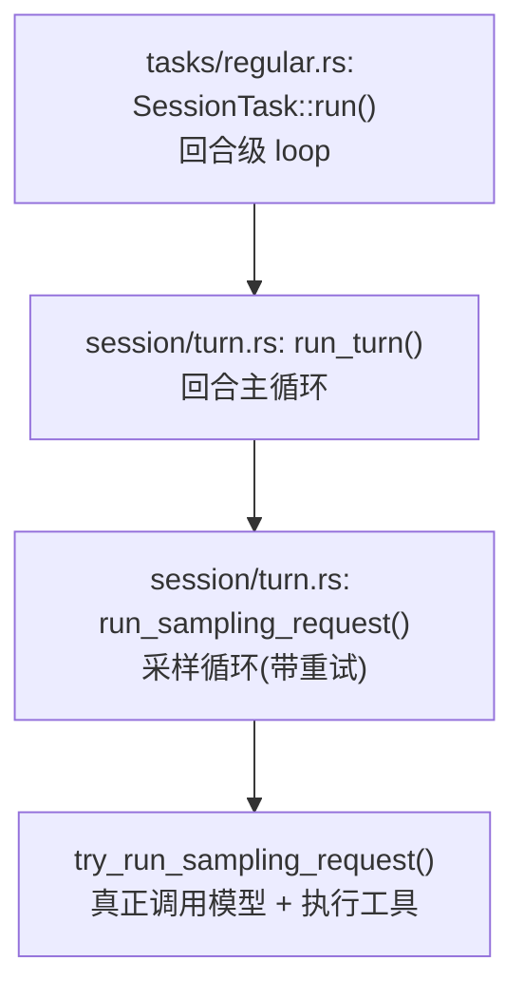

# 第 8 章 代码精读（三）：codex 的生产级回合

> **本章目标**
> 1. 逐行读懂 codex（OpenAI Codex CLI）的回合处理（`codex-rs/core/src/session/turn.rs`）；
> 2. 看懂"外层回合循环（run_turn）+ 内层采样循环（run_sampling_request）"的双层结构；
> 3. 学习生产级 Agent 的四个"保险"：重试、上下文压缩、钩子、世界状态；
> 4. 完成 pi / dsh / codex 三版循环的横向对比。

> **阅读前提**：请先读第 5、6、7 章。codex 是三个库里最大、最严谨的实现
> （`turn.rs` 约 2700 行）。我们只精读**主循环与采样循环**这两段核心，
> 其余细节（压缩、沙箱、钩子）在后续章节展开。

## 8.1 整体地图：从任务到回合到采样

codex 的调用链有三层，先记住这张地图：



| 层 | 函数 | 行号 | 职责 |
|----|------|------|------|
| 任务层 | `RegularTask::run` | `tasks/regular.rs` 39 起 | 一个"任务"= 多个回合；不断调用 run_turn |
| 回合层 | `run_turn` | `turn.rs` 153 起 | 一次"回合"= 多个采样；处理输入、上下文、压缩 |
| 采样层 | `run_sampling_request` | `turn.rs` 1322 起 | 一次"采样"= 请求模型 + 执行工具 + 重试 |

## 8.2 任务层：RegularTask::run（tasks/regular.rs）

```rust
// codex-rs/core/src/tasks/regular.rs（节选）
impl SessionTask for RegularTask {
	async fn run(
		self: Arc<Self>,
		sess: Arc<Session>,
		ctx: Arc<TurnContext>,
		input: Vec<TurnInput>,
		cancellation_token: CancellationToken,
	) -> SessionTaskResult {
		let mut next_input = input;                       // 首次输入
		let mut prewarmed_client_session = prewarmed_client_session;
		loop {                                            // ← 回合级循环
			let last_agent_message = run_turn(
				Arc::clone(&sess),
				Arc::clone(&ctx),
				next_input,
				prewarmed_client_session.take(),
				cancellation_token.child_token(),
			)
			.await?;                                      // 跑一个回合
			if !sess.input_queue.has_pending_input(&sess.active_turn).await {
				return Ok(last_agent_message);            // 没有待处理输入 → 任务完成
			}
			next_input = Vec::new();                      // 还有输入 → 再开一个回合
		}
	}
}
```

这里就是 5.2 节说的"外层回合循环"在 codex 的形态：
**`loop { run_turn(...) }`，直到输入队列没有待处理输入。**

- `run_turn` 每次处理一个回合；如果运行期间用户又发来消息（进入输入队列），
  就再 `run_turn` 一次（`next_input` 清空，因为输入从队列取）。
- `cancellation_token.child_token()`：为每个回合创建"子取消令牌"——
  取消任务时，子令牌级联取消，但允许各层独立响应。
- `prewarmed_client_session`：一个**预热好的模型客户端会话**（复用 WebSocket 连接、
  路由状态），用于减少回合启动延迟。这是生产级性能优化。

## 8.3 回合层：run_turn 的主循环（turn.rs 153 行起）

`run_turn` 的开头做一堆"回合前准备"（前置压缩、MCP 服务器发现、上下文快照、
技能/插件注入），然后进入主循环。我们略过准备细节，直接看主循环的结构
（`turn.rs` 约第 270 行起的 `loop`）：

```rust
// turn.rs（节选，主循环骨架）
let mut next_step_context = Some(first_step_context);
loop {
	// ① 取待处理输入（用户在模型运行时发来的消息）
	let pending_input = if can_drain_pending_input {
		sess.input_queue.get_pending_input(&sess.active_turn).await.0
	} else { Vec::new() };

	// ② 记录输入（hook + 持久化）
	if run_hooks_and_record_inputs(&sess, &turn_context, &pending_input, PersistContext::Standard).await {
		break;
	}

	// ③ 捕获"步骤上下文"（当前世界状态、工具清单、模型信息）
	let step_context = match next_step_context.take() {
		Some(step_context) => step_context,
		None => sess.capture_step_context(Arc::clone(&turn_context), &cancellation_token).await?,
	};

	// ④ 构造发给模型的输入（从历史派生）
	let sampling_request_input: Vec<ResponseItem> = sess.clone_history()
		.await
		.for_prompt(&turn_context.model_info.input_modalities);

	// ⑤ 采样（请求模型 + 执行工具 + 重试）
	let sampling_request_result = run_sampling_request(
		Arc::clone(&sess), Arc::clone(&step_context), ...,
		sampling_request_input, cancellation_token.child_token(),
	).await;

	match sampling_request_result {
		Ok((output, _)) => {
			let SamplingRequestResult { needs_follow_up, last_agent_message } = output;
			// ⑥ 上下文是否触顶？是 → 自动压缩后继续
			let token_status = context_window_token_status(...).await;
			if token_limit_reached {
				run_auto_compact(...).await?;   // 压缩历史，腾出空间
				can_drain_pending_input = !model_needs_follow_up;
				continue;                        // 压缩后继续同一回合
			}
			// ⑦ 模型说"需要跟注"或还有待处理输入 → 继续
			if needs_follow_up || has_pending_input { continue; }
			// ⑧ 停止钩子 / 无后续 → 回合结束
			last_agent_message = ...;
			if run_turn_stop_hooks(...).should_stop { break; }
			break;
		}
		Err(e) => { /* 错误处理：发送 Error 事件，break 让用户继续 */ }
	}
}
```

逐段解读主循环的决策逻辑：

- **① 取待处理输入**：用户在模型运行时又发了消息，先从输入队列取出。
  注意 `can_drain_pending_input` 标志——首回合的初始输入在 `input` 里，
  先采样它，不急着排空队列（避免打乱顺序）。
- **② 记录输入**：`run_hooks_and_record_inputs` 同时做两件事：跑钩子 + 持久化输入。
  **钩子（hooks）是 codex 的生产级扩展点**（第 12 章细讲）；持久化保证可恢复。
- **③ 捕获步骤上下文**：`capture_step_context` 快照当前"世界状态"（文件系统、
  环境、工具路由器、模型信息）。**一个步骤只捕获一次**，保证"上下文、广告给模型的
  工具、实际执行的工具"共享同一个视图，避免竞态。
- **④ 从历史派生模型输入**：`clone_history().for_prompt(...)` —— 和 dsh 的
  `deriveMessages()` 同思路：**每次请求的输入都由会话历史派生**。
- **⑤ 采样**：`run_sampling_request`（8.4 节）。
- **⑥ 上下文触顶 → 自动压缩**：采样后发现 token 触顶，就调用 `run_auto_compact`
  压缩历史（第 10 章详述），压缩后**继续同一回合**。这是生产级"不会因上下文满而中断"
  的关键设计。
- **⑦ 需要跟注**：`needs_follow_up` 是采样返回的一个标志——模型明确表示
  "我还没完"（比如还有更多工具要用），或者有待处理输入，就 `continue` 继续采样。
- **⑧ 停止**：跑"回合停止钩子"（stop hooks），如果要求停止就 `break`；
  否则正常结束回合，返回最后一条 agent 消息。

> **对比 pi / dsh**：codex 的回合循环把"上下文压缩"直接内置为循环的一环，
> 这是前两者没有的（pi 完全没有；dsh 的压缩由独立插件在维护阶段做）。
> 另外 codex 大量使用 **hooks**（钩子）作为扩展点，贯穿回合的开始、停止、采样前后。

## 8.4 采样层：run_sampling_request（turn.rs 1322 行起）

`run_sampling_request` 是"请求模型 + 执行工具 + 重试"的循环。它比 pi 的
`streamAssistantResponse` 多了**显式的重试循环**。它的结构：

```rust
// turn.rs（节选，run_sampling_request 骨架）
loop {
	// 构造 prompt（输入 + 工具 + 基础指令）
	let prompt = build_prompt(prompt_input, router.as_ref(), turn_context.as_ref(), base_instructions.clone());

	let err = match try_run_sampling_request(   // 真正请求模型 + 执行工具
		tool_runtime.clone(), ..., &prompt, cancellation_token.child_token(),
	).await {
		Ok(output) => return Ok((output, original_input.unwrap_or(prompt.input))),  // 成功即返回
		Err(err) => match err.details() {
			CodexErrorDetails::ContextWindowExceeded => { ...; return Err(err); }   // 上下文超限
			CodexErrorDetails::UsageLimitReached(e) => { ...; return Err(err); }    // 额度用尽
			_ => err,
		},
	};

	if !err.is_retryable() { return Err(err); }   // 不可重试的错误 → 直接失败

	// 可重试：交给"重试状态机"，处理指数退避/最大次数
	handle_retryable_response_stream_error(
		&mut retry_state, max_retries, err, client_session, &sess, &turn_context, ...,
	).await?;
	turn_context.turn_timing_state.record_sampling_retry();  // 记录一次重试
}
```

- **prompt 构建**：`build_prompt` 把"历史 + 工具路由器（tool_router）+ 基础指令"
  合成一次采样的完整输入。**工具不是一次性全给，而是经过路由器筛选**——codex
  会根据上下文和会话状态动态决定哪些工具可见（工具暴露控制，第 12 章）。
- **`try_run_sampling_request`**：真正调用模型流、处理流式输出、执行工具。
  它内部还会跑"工具执行运行时"（`ToolCallRuntime`），以及把执行过的工具调用
  记录到 `executed_tool_calls`（`attach_pending_to_prompt` 把待完成的工具调用
  重新附加到后续 prompt）。
- **错误分类**：`ContextWindowExceeded`（上下文超限）和 `UsageLimitReached`
  （额度用尽）是**特判**，分别处理；其他错误看 `is_retryable()`。
- **重试状态机**：`handle_retryable_response_stream_error` 管理重试次数
  （`max_retries` 来自 provider 的 `stream_max_retries()`）、指数退避、
  以及网络/流中断的恢复。**注意 `client_session` 跨重试复用**——注释说明
  `ModelClientSession` 是回合级的，缓存 WebSocket + 粘性路由，重试时不重建。

> **对比 pi / dsh**：pi 没有重试；dsh 把重试决策交给 `agent/request-error` 瀑布
> （插件决定）；codex 把重试**内建在采样循环**里，用专门的状态机管理退避与次数。
> 三种"重试"策略，正好是"无 → 插件化 → 内建"三种层次。

## 8.5 生产级的"四大保险"，逐一对照

读完三层循环，我们把 codex 相对前两个库额外引入的"保险"列全：

### 保险一：重试与退避（retry）
由 `run_sampling_request` 的内层循环 + `ResponsesStreamRetryState` 承担。
针对流中断、网络抖动、临时限流等**可重试**错误，自动重试并退避。

### 保险二：上下文压缩（compaction）
`run_auto_compact`（`turn.rs` 1160 行起）。当 token 触顶时，
把对话历史压缩成摘要，腾出空间继续。它还会"重建世界状态"
（`InitialContextInjection::BeforeLastUserMessage`），把压缩后的环境快照
重新注入，让模型不因压缩而"失忆"（第 10 章）。

### 保险三：钩子系统（hooks）
`run_hooks_and_record_inputs`、`run_turn_stop_hooks`、`run_pending_session_start_hooks`
……codex 在**回合开始、输入记录、回合停止、采样前后**都埋了钩子。
钩子可以让外部代码注入消息、修改行为、甚至"阻塞"回合（`should_block`）。

### 保险四：世界状态（world state）
`world_state`、`record_step_world_state_if_changed`。codex 持续追踪**文件系统、
环境、终端的当前状态**，用于压缩后的环境重建、以及 diff 展示
（`TurnDiffTracker` 追踪每个回合改了哪些文件）。

## 8.6 三版循环最终对照

至此，三章代码精读完成。用一张总表收束：

| 维度 | pi | dsh | codex |
|------|-----|-----|-------|
| 语言/风格 | TS，函数式 | TS，类+状态机 | Rust，trait+异步 |
| 外层循环 | `while(true)` 回合 | `kick()`→`turn()` | `RegularTask::run`→`run_turn` |
| 内层循环 | `while` 步骤 | `step()` 内 while | `run_sampling_request` loop |
| 会话 | 内存数组 | 持久化事件日志 | 持久化 + 世界状态 |
| 错误处理 | stopReason 分支 | 结构化 TurnEndReason | CodexError 分类 + 重试 |
| 重试 | 无 | 插件瀑布决定 | 内建状态机 + 退避 |
| 上下文压缩 | 无 | 独立插件 | 内建 `run_auto_compact` |
| 扩展点 | 可选钩子 | waterfall/serial | hooks + plugins + MCP |
| 沙箱 | 无内建 | landlock 等（原生层） | 强沙箱（见第 13 章） |

**三个库讲的是同一个故事**：第 5 章的骨架，被 pi 讲清楚、被 dsh 工程化、
被 codex 生产化。你现在读任何一个 Agent 框架的循环代码，都能自动定位
"它在骨架的哪一步、加了什么保险"。

## 8.7 本章小结

- codex 的推理 = 任务层（多回合）→ 回合层（run_turn）→ 采样层（run_sampling_request）；
- 回合主循环的关键决策：取输入 → 记录 → 采样 → 判断"压缩 / 继续 / 停止"；
- 采样循环内置**可重试 + 指数退避**，并区分可重试与不可重试错误；
- 生产级四大保险：重试、压缩、钩子、世界状态；
- 三库对照完成：同一骨架的三种工程层次。

## 动手练习

1. **数保险**：在 `turn.rs` 里搜索 `run_auto_compact`、`run_turn_stop_hooks`、
   `handle_retryable_response_stream_error`，各读 20 行，理解它们被调用的时机。
2. **追踪一个回合**：给 `run_turn` 的主循环画一张带"continue / break"标注的流程图，
  标出所有可能 `continue`（继续采样）和 `break`（结束回合）的分支。
3. **思考题**：codex 把压缩做进循环（`continue` 后继续），而 dsh 把压缩放在
   "维护阶段"。两种做法各自的优缺点是什么？（提示：从"模型中途失忆"和
   "循环复杂度"两个角度想，参考附录 C）
4. **横向挑战**：如果让你从零写一个 Agent，你会先模仿 pi、dsh 还是 codex？
   为什么？把你的理由写成一段话。

---

**下一章**：[第 9 章 三种循环的对比与设计权衡](./ch09-loop-comparison.md)
三章代码精读之后，我们退后一步，从"设计权衡"的高度总结：为什么三个库
会做成三种样子？换你会怎么选？
