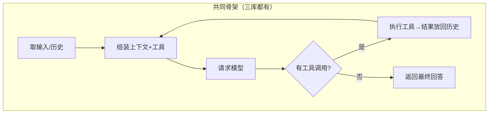

# 第 9 章 三种循环的对比与设计权衡

> **本章目标**
> 1. 从"设计权衡"的高度总结三个代码库的差异；
> 2. 学会用"骨架 + 保险"的框架快速读懂任何 Agent 循环；
> 3. 建立选型视角：什么场景该参考哪个库。

## 9.1 三章精读之后，我们退后一步

第 6、7、8 章我们扎进了三个循环的细节。现在退后一步，你会发现一个惊人的事实：
**三者的"骨架"一模一样**，差别全在"每一层加了什么"。

这个骨架，**三库逐行对上**：

| 骨架环节 | pi | dsh | codex |
|---------|-----|-----|-------|
| 取输入 | `pendingMessages` | `Inbox.claim` | `input_queue.get_pending_input` |
| 组装上下文 | `streamAssistantResponse` 组装 Context | `preStep` + `assembleContextFor` | `capture_step_context` + `build_prompt` |
| 请求模型 | `streamFunction` | `ctx.llm.stream` | `try_run_sampling_request` |
| 判断工具调用 | `filter(c => c.type === "toolCall")` | `filter(block => block.type === 'tool-call')` | 按 ResponseItem 类型判断 |
| 执行工具 | `executeToolCalls` | `executeToolCalls`（scheduler） | `ToolCallRuntime` |
| 结果放回历史 | `messages.push(result)` | `session.append` + Inbox | `record_conversation_items` |
| 返回最终回答 | `return finalMessage` | `{ kind: 'completed' }` | `return last_agent_message` |

**如果你只从这本书带走一句话，请带走这句**：

> **所有 Agent 都是同一个循环；差别只在循环的每一步，你愿意投入多少"工程保险"。**

## 9.2 为什么三个库会做成三种样子？

一个代码库的形态，几乎完全由它的**目标**决定。三库的目标不同，所以形态不同。

### pi：为"可读性"和"快速演进"而生

- **目标**：一个清晰的参考实现，让开发者（包括它的维护者）能快速理解、快速改。
- **取舍**：宁可少一些"生产级"能力，也要保持代码量小、结构直白。
  会话不持久化、没有内建重试/压缩/沙箱。
- **适合**：学习、原型、想快速验证想法的人。

### dsh：为"插件化生态"和"长期演进"而生

- **目标**：一个让团队/第三方可以**安全扩展**的平台底座。
- **取舍**：愿意付出"结构重、概念多（服务/接缝/瀑布/会话日志）"的代价，
  换取"不修改核心代码也能加能力"的扩展性，以及"模型可见 ⟺ 可记录"的可追溯性。
- **适合**：要构建自己的 Agent 产品、需要多人协作和插件生态的团队。

### codex：为"大规模日常使用"和"稳定性"而生

- **目标**：一个被成千上万真实用户每天使用的生产工具。
- **取舍**：愿意付出"代码量巨大、阅读门槛高"的代价，换取**稳定性、安全、性能**。
  重试、压缩、沙箱、钩子、世界状态……全是"用户会用脚投票"的能力。
- **适合**：追求极致稳定和安全的场景；也是研究"生产级 Agent 该考虑什么"的最佳教材。

### 一张"目标→取舍"表

| 目标 | pi | dsh | codex |
|------|-----|-----|-------|
| 代码可读性 | ★★★ | ★★ | ★ |
| 扩展性 | ★★ | ★★★ | ★★★（hooks/MCP/插件） |
| 持久化/可复现 | ★ | ★★★ | ★★★ |
| 稳定性/容错 | ★ | ★★ | ★★★ |
| 安全/沙箱 | ★ | ★★★（原生层） | ★★★ |
| 学习友好度 | ★★★ | ★★ | ★ |

> ★ 不代表绝对高低，代表"这个库在该维度上的投入程度"。pi 的不持久化是
> 刻意的简，不是缺陷。

## 9.3 三个最值得玩味的设计分歧

### 分歧一：会话要不要持久化？

- pi：**不持久化**。`context.messages` 是内存数组，进程结束就没了。
- dsh / codex：**持久化**，且以"日志/历史"为唯一真相源。

**权衡**：持久化带来可恢复、可审计、可复现，但带来"写日志"的开销和复杂度。
如果你做的是"跑一次就完"的工具，pi 的轻量够用；如果是长期运行的 agent 服务，
dsh/codex 的持久化几乎是必需品。dsh 更进一步，把"模型可见 ⟺ 日志可重建"
做成了**不变量**（第 11 章），连"重建请求"都能做到——这在调试"模型为什么
这么回答"时是无价之宝。

### 分歧二：重试放哪？

- pi：**不放**。出错就结束回合。
- dsh：**插件决定**。`agent/request-error` 瀑布让外部代码决定是否重试。
- codex：**内建状态机**。`run_sampling_request` 循环 + 退避 + 次数限制。

**权衡**：内建（codex）最可靠，但把策略写死在框架里，不够灵活；
插件化（dsh）最灵活，但要求"有人注册了重试插件"才生效；不放（pi）
最简单，但真实环境下模型 API 偶尔抖动就会让任务失败。
**这是一个典型的"可靠性 vs 灵活性 vs 简单性"三难**——没有标准答案，
取决于你的产品对失败有多敏感。

### 分歧三：上下文压缩由谁负责？

- pi：**没有压缩**。上下文满了就超出窗口。
- dsh：**独立插件**在"维护阶段"做压缩。
- codex：**内建在回合循环里**，采样后发现触顶就压缩再继续。

**权衡**：codex 的方案体验最好（用户无感），但实现最复杂，因为它要处理
"压缩后如何重建世界状态让模型不失忆"；dsh 的方案把压缩从循环里抽出去，
循环更清晰，但压缩时机更难精准对齐"模型请求前"；pi 直接不做，适合短任务。
（我们在第 10 章会深入压缩这个话题。）

## 9.4 一种通用读法：任何 Agent 循环，三问定位

以后你读任何新的 Agent 框架（LangGraph、CrewAI、自研……），别被它的术语
（nodes/edges、agent/thread、stage……）吓住，用三个问题定位它：

1. **它在骨架的哪一步？**（取输入 / 组上下文 / 请求模型 / 判断输出 / 执行工具 / 返回）
2. **它的"回合"和"步骤"各是什么？**（外层循环管什么、内层循环管什么）
3. **它加了哪些"保险"？**（重试？压缩？持久化？沙箱？钩子？）

想明白这三个问题，你就能"翻译"任何框架。术语只是表象，骨架才是本质。

## 9.5 核心篇收尾：你已经可以"造"一个 Agent 了

到本章为止，你已经理解了 Agent 最核心的机制。事实上，你现在已经具备
写一个"最小可用 Agent"的全部知识了——第 14 章我们会真的动手写。
在那之前，进阶篇（第 10–13 章）会帮你补齐"把一个能跑的循环，做成一个
能长期用的产品"所需的四块拼图：

- 第 10 章：上下文管理（系统提示词 + 压缩）——**让 Agent 不"失忆"、不"撑爆"**；
- 第 11 章：会话与记忆（持久化 + 可复现）——**让 Agent 可追溯、可恢复**；
- 第 12 章：能力扩展（插件、技能、MCP）——**让 Agent 什么都会**；
- 第 13 章：安全边界（沙箱 + 权限）——**让 Agent 不出乱子**。

## 9.6 本章小结

- 三个库共享同一个"骨架循环"，差异全在工程保险的投入；
- 库的形态由目标决定：pi=可读、dsh=可扩展、codex=稳定安全；
- 三个最值得玩味的分歧：持久化、重试位置、压缩归属；
- 用"骨架 + 回合/步骤 + 保险"三问，可读懂任何 Agent 循环；
- 你已经具备写最小 Agent 的知识，进阶篇补齐产品化拼图。

## 动手练习

1. **翻译练习**：选一个你没读过的 Agent 框架（比如 LangGraph 的
   "StateGraph"），用 9.4 节的三问，在文档里定位它的循环骨架。
2. **写对比笔记**：为三库各写一段"如果我在 X 场景下会怎么选、为什么"。
3. **小组讨论题**：你认为"持久化会话"对 Agent 是必需品还是奢侈？
   从成本、调试、隐私三个角度给出你的结论。

---

**第二部分（核心篇）到这里结束。** 你已经读完了三个代码库最核心的推理循环。
从下一章开始，进入进阶篇——把"能跑的循环"升级成"能用的产品"。
第一站是**上下文管理**：为什么 Agent 会"忘事"？为什么上下文会"爆炸"？
怎么解决？

**下一章**：[第 10 章 上下文管理：系统提示词与压缩](./ch10-context-management.md)
