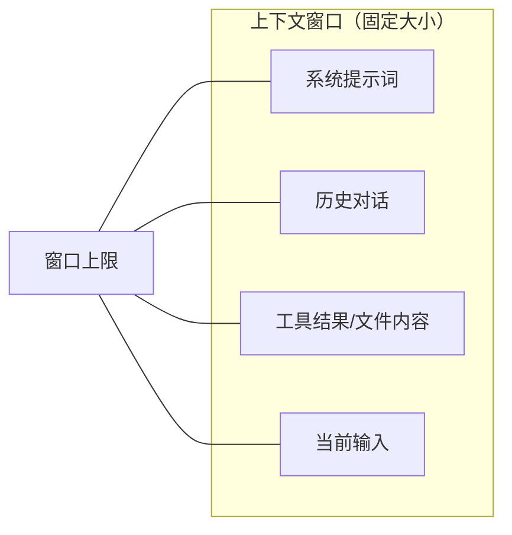
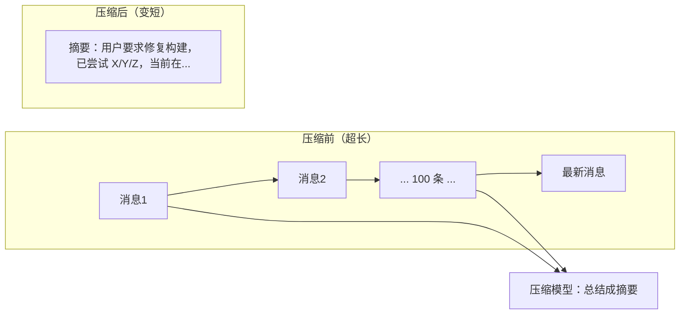

# 第 10 章 上下文管理：系统提示词与压缩

> **本章目标**
> 1. 理解"上下文窗口"这个硬约束，以及它带来的两大问题：失忆与超限；
> 2. 看懂系统提示词是如何"组装"出来的（dsh 的 section 机制）；
> 3. 理解上下文压缩（compaction）的原理与实现（codex / pi / dsh）；
> 4. 学会"token 预算"的思维，写好长任务的 Agent。

## 10.1 生活化开场：一位"记性差"但"本子厚"的同事

我们说过，模型没有记忆，它的"记忆"全写在每次发给它的"小本本"（消息数组）里。
但这个小本本有一个**物理限制**：一次最多只能看这么多字。

- 你让 Agent 读了一个 20 万字的文件，然后又聊了 100 轮——**小本本放不下了**。
- 模型看得多，每次请求的费用和时间也在涨——**小本本越厚，越贵越慢**。

这就是 Agent 工程里最重要的一个约束：**上下文窗口（Context Window）**。
几乎所有 Agent 框架的复杂度，都有一半是为了跟这个约束斗争。



围绕这个窗口，有两大永恒难题：

1. **失忆**：窗口有限，装不下所有历史，必须取舍（该删什么、该压缩什么）；
2. **超限**：一旦超了，请求直接失败（`ContextWindowExceeded`），必须提前预防。

本章讲两个应对手段：**系统提示词的组装**（让"该记住的"进得去）和
**上下文压缩**（让"装不下的"被提炼）。

## 10.2 系统提示词：Agent 的"永久记忆区"

**系统提示词（System Prompt）** 是消息数组里最特殊的一段——它在每次请求时
都在最前面，告诉模型"你是谁、你的任务、你的约束"。它相当于 Agent 的"出厂设置"，
是**优先级最高、通常不会被压缩掉**的那部分记忆。

一个生产级 Agent 的系统提示词，往往不是一段死文本，而是**很多部分拼起来的**。
看 dsh 的实现（`packages/core/system-prompt/src/index.ts`）：

```ts
// dsh packages/core/system-prompt/src/index.ts（节选）
/** 一个"注册进来的系统提示片段" */
export interface PromptSection {
	readonly name: string               // 唯一名字
	readonly order: number              // 排序权重（决定拼接顺序）
	readonly text: string | ((context: AssembleContext) => string)  // 静态文本或动态函数
}
```

注意 `order` 字段——**系统提示由许多"片段（section）"按顺序拼接而成**。
dsh 甚至给排序约定了惯例（见它的注释）：

> Sections are concatenated in ascending order. Convention: `-100` is the
> harness identity, `0` the deployment persona, tool guidance uses 100–199...

翻译过来：`-100` 放"框架身份"（我是谁、什么协议）、`0` 放"部署人设"
（这个产品希望模型扮演什么角色）、`100–199` 放"工具使用指南"……


**这种"分片段 + 排序 + 动态求值"的设计，解决了三个问题**：

1. **谁都能往里加**：任何插件都能注册一个 section，不用改核心代码；
2. **顺序可控**：身份在最前，工具指南在后，符合模型"先立规矩再给工具"的阅读习惯；
3. **动态内容**：`text` 可以是一个函数，每次组装时求值——比如注入"当前时间"、
   "当前仓库"、"用户配置文件"。

而 `renderPrompt(assembly)` 最终把所有片段拼成一段文本（第 7 章 `step()` 里
见过 `const system = renderPrompt(assembly)`）。dsh 还有 `renderContextSections`
来拼"运行时上下文"（当前时间、环境信息等），在 `preStep` 里作为一条 user 消息
注入——这部分是**动态的、每回合都变**的。

**pi 和 codex 的系统提示更"朴素"**：pi 直接给一个 `systemPrompt` 字符串
（`Context.systemPrompt`）；codex 有 `get_base_instructions()`（基础指令）
和动态注入的"context items"。dsh 的"分片机制"是最工程化的——它把
"系统提示怎么拼"也变成了可插拔的。

## 10.3 动态上下文：每次请求都注入的"新信息"

除了静态系统提示，Agent 还会注入**动态上下文**——每次请求都重新生成的信息：

| 动态信息 | 例子 | 谁负责注入 |
|---------|------|-----------|
| 当前时间 | "现在是 2026-08-15 22:00" | dsh 运行时上下文 / codex `maybe_record_current_time_reminder` |
| 工作目录 | "你在 /path/to/project" | dsh 上下文投影 / codex step context |
| 用户偏好 | "用户喜欢中文回复" | 用户配置注入 |
| 技能/说明文档 | 项目 AGENTS.md 摘要 | 技能系统（第 12 章） |

这些信息的特点是**时效性强**（时间会变）或**与当前工作强相关**（目录、
分支）。dsh 的 `RuntimeContextProjection`（`agent-loop/src/runtime-context.ts`）
专门做这件事——在 `preStep` 时把"运行时上下文"投影进当前步骤。
codex 则在 `time_reminder`、`realtime_context` 等模块里做同样的事。

> **为什么动态上下文必须"每回合重算"？** 因为一个 Agent 可能运行几小时，
> 时间、分支、文件状态都在变。如果缓存昨天的"当前时间"，模型会认为现在是昨天。

## 10.4 上下文压缩：当"小本本"装不下时

### 10.4.1 压缩是什么

**压缩（compaction）**：把"太长而装不下"的历史，**让模型自己总结成一段更短的摘要**，
用摘要替换（或补充）原有历史，腾出空间继续跑。



压缩的关键难点在**"压缩后模型不能失忆"**——摘要必须保留足够的关键事实
（目标、已做的尝试、当前状态），让模型能无缝继续。如果摘要丢了三瓜两枣，
Agent 就可能"忘记自己正在干什么"。

### 10.4.2 codex 的压缩：内建在回合循环里

codex 把压缩做进了回合主循环（第 8 章 8.3 节的"⑥"分支）：

- 采样后检查 token 状态，发现触顶就调用 `run_auto_compact`（`turn.rs` 1160 行起）；
- 压缩时用 `CompactionReason::ContextLimit` 标记原因，并**重建世界状态**
  （`InitialContextInjection::BeforeLastUserMessage`）——把文件系统、环境等
  环境快照在压缩后重新注入，**让模型即使看到的是摘要，也知道当前文件长什么样**；
- 压缩完成后 `continue`，用新的（更短的）历史继续采样。

它还有一整套子模块：`compact.rs`（核心）、`compact_remote.rs`（远程压缩，调用
云端做摘要）、`compact_token_budget.rs`（压缩预算）。甚至支持"压缩失败时回退到
更小的模型"（`compact_model_fallback.rs`）。

### 10.4.3 pi 的压缩：CLI 层的"分支总结"

pi 的压缩在 `packages/coding-agent/src/core/compaction/`，有两个概念：
`compaction.ts`（压缩）和 `branch-summarization.ts`（分支总结）。
它的做法是把**旧的分支（branch）总结成摘要**，然后在主会话里引用。
"分支"是 pi 用来管理长对话工作区的概念——把过去的探索总结掉，主线程保持精简。

### 10.4.4 dsh 的压缩：独立插件

dsh 把压缩做成**独立插件**（`packages/compaction/compaction-basic/`），
在"维护阶段"（maintenance）执行，而不是内建在循环里。它提供：
`summarizer.ts`（调用模型做摘要）、`region.ts`（标记可压缩的区域）、
`command-compact`（用户手动触发 `/compact` 命令）。

**为什么 dsh 把它做成插件？** 因为它贯彻"一切皆插件"——压缩不是循环的固有职责，
而是可以被替换/扩展的能力。这也呼应了第 9 章"压缩由谁负责"的分歧。

## 10.5 Token 预算：提前算账，而不是等超限

比"超限后压缩"更高级的做法是**提前预算（token budget）**——在发请求前估算
这次会用多少 token，提前决定要不要压缩、要不要截断工具结果。

- codex 有 `token_budget.rs`、`context_window.rs`：估算当前上下文用量，
  在采样后报告 `token_limit_reached`，驱动压缩决策；
- dsh 有 `packages/llm/token-meter/`（token 计量）和会话日志里的 usage 记录；
- pi 有 `usage-totals.ts`（用量统计）和 `output-guard.ts`（输出保护，防止输出过长）。

**给工具结果的"预算"尤其重要**：一次 `bash` 工具可能返回几十万字符。
如果不截断，一次就把窗口塞满。所以生产级 Agent 都会**截断过长的工具输出**
（dsh 的工具结果裁剪插件 `compaction-tool-result-pruner`、codex 的输出截断、
pi 的 `truncate.ts`）。

## 10.6 三库对照：上下文管理能力地图

| 能力 | pi | dsh | codex |
|------|-----|-----|-------|
| 系统提示 | 单字符串 | 分片 section + 瀑布 | 基础指令 + context items |
| 动态上下文 | 转换钩子 | RuntimeContextProjection | realtime_context / time_reminder |
| 压缩 | CLI 层分支总结 | 独立插件（maintenance） | 内建 run_auto_compact + 远程压缩 |
| token 计量 | usage-totals | token-meter | token_budget / context_window |
| 输出截断 | truncate / output-guard | tool-result-pruner | exec 输出截断 |

## 10.7 本章小结

- 上下文窗口是 Agent 的硬约束，带来"失忆"与"超限"两大难题；
- 系统提示词是"永久记忆区"，dsh 用"分片 + 排序 + 动态求值"工程化地组装；
- 动态上下文（时间、环境）每回合重算；
- 压缩（compaction）是"超限"后的解法：让模型总结历史、重建环境快照；
- token 预算与输出截断是"提前算账"的预防手段；
- 三库对"压缩由谁负责"有不同的架构选择。

## 动手练习

1. **找 section**：在 dsh 仓库里 `grep -rn "systemPrompt.section" packages/`，
   看有哪些插件注册了系统提示片段，各自 `order` 是多少、`text` 是静态还是动态。
2. **测截断**：在 pi 里找一个工具（如 `bash.ts`），看它如何截断超长输出
   （搜 `truncate`），思考截断阈值应该怎么设。
3. **思考题**：压缩时，为什么需要"重建世界状态"而不是只压缩对话？
   结合"模型没有记忆，只有输入"这一事实回答。

---

**下一章**：[第 11 章 会话与记忆：让 Agent 可复现](./ch11-session-and-memory.md)
上下文管理解决了"装不下"，本章解决"忘不掉"——会话持久化与可复现性。
