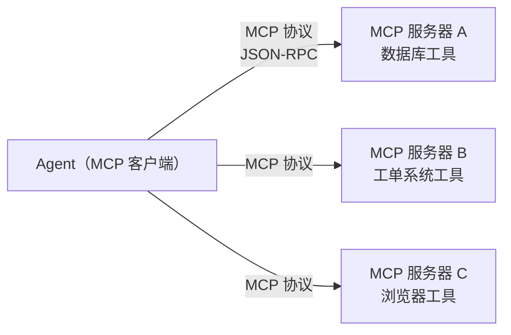

# 第 12 章 扩展 Agent：插件、技能与 MCP

> **本章目标**
> 1. 理解 Agent 扩展的三种层次：插件（框架级）、技能（模型级）、MCP（工具协议级）；
> 2. 看懂 dsh 的"一切皆插件"如何落地；
> 3. 理解"技能（skill）"到底是什么、三库如何实现；
> 4. 理解 MCP 是什么、为什么它成为行业标准。

## 12.1 生活化开场：给新同事"装技能"

回到我们的新同事（Agent）。他刚入职时只会最基本的几件事（聊天、用默认工具）。
要让他胜任各种工作，你需要不断给他"加能力"：

- **加一个工具**：给他一把"螺丝刀"（读文件工具、跑命令工具）；
- **加一份技能文档**：给他一份"如何做代码评审"的 SOP（标准作业流程）；
- **加一套规范**：告诉他"这个项目的代码风格是什么"（AGENTS.md）；
- **接一个外部系统**：让他能操作"公司的工单系统"（MCP 服务器）。

这四种"加能力"的方式，恰好对应 Agent 生态里的四种扩展机制。
本章把它们讲清楚，并对照三个代码库。

| 扩展方式 | 本质 | 三个库里的形态 |
|---------|------|---------------|
| **工具（tool）** | 新增一个可调用的函数 | 第 3 章讲过，三库都有 |
| **插件（plugin）** | 修改框架行为/注册新能力 | dsh 的 cordis 插件、codex 的 plugins |
| **技能（skill）** | 给模型的"文档型知识" | dsh 的 skill 服务、codex 的 skills、pi 的 skills |
| **MCP** | 统一的外部工具协议 | dsh/codex 都有 MCP 客户端 |

## 12.2 插件（Plugin）：改框架本身

### dsh："一切皆插件"

dsh 建立在 Cordis 之上，**一切能力都是插件**。看仓库布局，几十个 `packages/`
几乎都是"一个能力 = 一个插件包"（llm、shell、fs、web、lsp、skill、mcp、
subagent、compaction……）。插件的注册方式是：

```ts
// dsh 里一个插件的大致形态（示意）
export const myPlugin: Plugin = (ctx) => {
  // 注册工具
  ctx.tools.register({ name: 'my_tool', schema, execute })
  // 注册系统提示片段
  ctx.systemPrompt.section({ name: 'my-section', order: 50, text: '...' })
  // 拦截请求（waterfall）
  ctx.on('agent/request', async (args, next) => { ... })
  // 返回一个"卸载器"（注册即副作用）
  return () => { /* 清理 */ }
}
```

dsh 的 AGENTS.md 里有几条插件相关的约定，值得记住：

> **Registrations are effects**：every contribution goes through
> `ctx.effect()` / `ctx.on()`; a registry's `register()` returns the disposer.

翻译：**注册即副作用**——每个贡献都通过 `ctx.effect()`/`ctx.on()` 注册，
`register()` 返回"卸载器"。这意味着插件可以**安全地装上、卸下**，
不会留下残留状态。这是可组合、可测试的插件系统的关键。

还有一个我们第 7 章见过的概念：**瀑布（waterfall）**。
它是"让插件干预决策"的机制——监听器可以返回自己的值（短路）或调用
`next()` 继续。**记住 waterfall 的铁律**：必须调用 `next()` 才会继续，
否则会短路整条链（dsh 的 AGENTS.md 原话，第 7 章也提过）。

### codex：Rust 的插件 + 扩展 API

codex 的插件系统在 `codex-rs/core/src/plugins/`，配合 `codex-extension-api`。
它支持"可发现工具"（`discoverable.rs`）、"注入"（`injection.rs`）、
"提及（@ 语法）"（`mentions.rs`）。codex 还实现了 **钩子（hooks）**
（第 8 章见过 `run_turn_stop_hooks` 等）——钩子是"在特定时机运行外部命令/脚本"
的机制，用户可以在 `~/.codex/hooks.md` 里配置"采样前做什么、回合结束做什么"。

### pi：扩展 = 自定义工具 + 模式（modes）

pi 的扩展方式更"平"：主要是**自定义工具**（`AgentTool`）和**模式（modes）**
（`packages/coding-agent/src/modes/`，比如"自动模式/计划模式"），
以及 `extensions/` 下的少量扩展点。它没有 dsh 那么重的插件抽象，
但"注册一个工具"足够覆盖大多数扩展需求。

> **小结**：插件是"框架级扩展"——改的是框架行为。dsh 最重（一切皆插件）、
> codex 次之（插件 + hooks）、pi 最轻（工具 + 模式）。

## 12.3 技能（Skill）：给模型的"文档型知识"

**技能（skill）** 是近两年最火的 Agent 概念之一。它到底是什么？

> **技能 = 一份给模型看的"知识文档" + 触发条件。** 它不像工具那样是"可调用的函数"，
> 而是像"一份操作手册"，告诉模型"当遇到 X 类任务时，请按这份手册来做"。

最典型的例子是 `AGENTS.md`、`SKILL.md`——它们是"项目/技能的说明文档"，
Agent 会读取它们来学习"这个项目怎么构建、这个任务怎么做"。
我们当前这本书（以及你面前的这个环境）里的 `AGENTS.md`、`.agents/skills/`
就是活生生的例子。

### dsh 的 skill 服务

dsh 有完整的 skill 能力接缝（`packages/skill/`）：一个**服务定义**（注册表，
负责合并各 provider 的目录、解决同名冲突）+ 具体**provider**
（`skill-filesystem` 从文件系统读技能）。看它的注释：

> This package owns the Service Definition role of the skill capability seam.
> Concrete providers such as `@deepseek-ai/dsh-skill-filesystem` decide where
> skills come from; this service only merges provider catalogs, resolves the
> winning skill for a name...

技能来源（`SkillSource`）包括 `project-dsh`（项目 .dsh 目录）、`project-agents`
（项目 .agents 目录）、`runtime`、`user-dsh`、`bundled`……还有技能名的
**kebab-case 校验**（`/^[a-z0-9]+(?:-[a-z0-9]+)*$/`）。这些来源最终被
**折叠进系统提示词**（作为工具指南部分），让模型知道"有哪些技能可用、什么时候用"。

### codex 的 skills

codex 有 `codex-rs/core/src/skills.rs` 和 `codex_skills` crate，支持
**隐式技能调用检测**（`detect_implicit_skill_invocation`）——根据用户输入
自动判断该加载哪些技能（比如用户说"写个迁移脚本"，自动加载"迁移"技能）。
它还有技能作用域（`SkillScope`）、技能根目录（`PluginSkillRoot`）等管理。

### pi 的 skills

pi 的 `packages/coding-agent/src/core/skills.ts` 从文件系统读取技能文档
（带 frontmatter 元数据：名称、描述、最大长度限制），并支持 `.gitignore`
式的忽略规则（`prefixIgnorePattern` 处理 ignore 文件）。它会把技能内容
注入到系统提示词，让模型掌握"怎么在这个项目里干活"。

> **小结**：技能 = 文档型知识，注入系统提示词。三库都实现了"从文件读技能文档
> → 注入模型上下文"的管线。dsh 把"读技能"做成可插拔服务，codex 加了
> "自动触发"，pi 保持了简单直接。

## 12.4 MCP：统一的外部工具协议

### MCP 是什么

**MCP（Model Context Protocol，模型上下文协议）** 是一个开放协议，
让 Agent 通过**标准化的方式连接外部系统**（数据库、工单系统、浏览器、文件服务……）。
你可以把它理解成"Agent 世界的 USB-C 接口"——只要外部系统实现了 MCP 服务器，
任何支持 MCP 的 Agent 客户端都能连上它，用它的工具。



MCP 的几个关键概念：

| 概念 | 含义 |
|------|------|
| **客户端（client）** | Agent 端，发起连接、调用工具 |
| **服务器（server）** | 外部系统端，暴露工具/资源/提示 |
| **工具（tool）** | 服务器暴露的可调用函数（schema 同第 3 章） |
| **资源（resource）** | 服务器暴露的可读数据（如文档、查询结果） |

### dsh 的 MCP

dsh 有 `packages/mcp/`，包含 `connection.ts`（连接管理）、`tools.ts`
（把 MCP 工具映射成 dsh 工具）、`transport.ts`（传输层）。
dsh 把 MCP 工具**翻译成自己的 `ToolSchema`**，这样 Agent 循环完全无感——
"外部系统的工具"和"本地工具"在循环看来没有区别。

### codex 的 MCP

codex 支持 MCP 已经很成熟：`codex-rs/core/src/mcp.rs`、`mcp_runtime.rs`、
`mcp_tool_call.rs` 等。它有 MCP 服务器**预热**（`mcp_prewarm.rs`，提前连接减少
延迟）、MCP 刷新（`mcp_refresh.rs`）、以及 **MCP 工具审批模板**
（`mcp_tool_approval_templates.rs`，第 13 章会讲审批）。

### 为什么 MCP 会赢

MCP 解决了一个大痛点：**每个 Agent 都要为每个外部系统写一遍适配器**。
有了 MCP，外部系统只需实现一次服务器，所有 Agent 都能连。这就是为什么
OpenAI（codex）、Anthropic、DeepSeek 等都在拥抱它。

## 12.5 三库对照：扩展能力地图

| 能力 | pi | dsh | codex |
|------|-----|-----|-------|
| 插件系统 | 轻（工具+模式） | 重（cordis 插件+瀑布） | 中（plugins+hooks） |
| 技能 | skills.ts（文件注入） | skill 服务（provider 合并） | skills.rs（含自动触发） |
| MCP | 无内建 | packages/mcp | mcp.rs + 预热/审批 |
| 工具注册 | `AgentTool` | `ctx.tools.register` | `ToolSpec` + registry |
| 系统提示扩展 | `systemPrompt` 字符串 | section + 瀑布 | context items + 插件注入 |

## 12.6 本章小结

- 扩展 Agent 有四种方式：工具、插件、技能、MCP；
- 插件是"框架级扩展"：dsh 一切皆插件、注册即副作用、瀑布可拦截；
- 技能是"文档型知识"：读文件 → 注入系统提示；三库都有实现；
- MCP 是"统一外部工具协议"：一次实现，处处可连；
- 三库在"扩展性"上的投入不同，但都支持"工具 + 文档型技能 + 外部系统接入"。

## 动手练习

1. **读一个插件**：在 dsh 里选一个包（如 `packages/shell/`），找出它
   注册了哪些工具/系统提示片段/事件监听，理解"注册即副作用"。
2. **写一个 SKILL.md**：为你常用的一个工作流写一个 `SKILL.md`
   （含 YAML frontmatter：name、description），放在 `.agents/skills/`，
   观察它是否被 Agent 加载。
3. **连一个 MCP**：在 codex 或 dsh 里配置一个 MCP 服务器（可以用官方示例），
   看它的工具是否出现在 Agent 的工具清单里。
4. **思考题**：工具、插件、技能三者有什么区别？什么时候该用哪个？
   （提示：工具是"函数"，技能是"文档"，插件是"框架改造"。）

---

**下一章**：[第 13 章 安全边界：沙箱与权限](./ch13-security.md)
给 Agent 加满了能力，接下来必须给它"上锁"——否则它能删掉你的整个项目。
